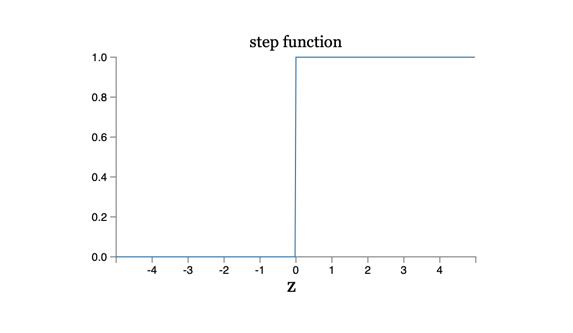

"plugins": [
    "katex"
]

## sigmoid神经元

学习算法听起来有些糟糕。不过，如果我们只是弄清楚如何在一个神经网络中使用这些算法呢？假如我们打算学习使用一个perceptron网络来解决一些问题。比如，神经网络的输入的数据是真实的黑白像素数据，来自于扫描过的手写数字图片。我们让网络能够自己学习其中的权重和偏移量，然后输出结果是能够正确地对输入的数字像素进行分类。为了弄明白网络是如何学习的，我们改变网络中的权重(偏移量也可以)一点点，我们期望的结果是，网络的输出会因此也发生一个对应的小变化。这使得学习成为可能。接下来我们会阐述这一点。下面的图示可以解释我们的需要是什么(显然这个简单的网络对于解决手写数字识别来说是不够的)。

假设对权重(或偏移量)做一个小的改变，则最终的输出的结果也只是发生一个小的变化，若假设成立，我们就可以利用这个机制，通过不断改变权重和偏移量来调整网络，网络将会按照我们期望的方式运行。举个例子，加入网络误将数字9误认为8，我们就可以通过微调权重和偏移量来让分类的结果更倾向是9。如果我们重复这一过程，反复调整权重和偏移量，我们将得到更准确的输出。网络就是这么学习的。

问题是，如果我们的网络包含了perceptrons，以上的机制就不灵了。实际上，无论是权重或者偏移量的微小调整，都可能导致最终输出结果的整个翻转，比如从0变为1.这个翻转将会使网络的其它部分发生完全的变化，整个过程会很复杂。尽管这个网络识别9的准确性提高了，识别其它数字的行为很可能被完全改变了，非常难以预测和控制。我们期望是通过权重或者偏移量的微小改变来让网络更接近于我们期望的方式工作，就变得十分困难了。或许会有其它更聪明的方法来绕过这个问题。但是如何让perceptrons完成学习并不是那么显而易见。
  我们可以通过引入一个新的人工神经元来克服这个问题---sigmoid神经元。他和perceptrons是类似的，不过做了优化调整，微小的权重或者偏移量的变化只会使输出产生一个小的改变。这是sigmoid神经元能够学习的一个关键特性。
  我来介绍一下sigmoid神经元，我们用描述perceptrons相同的方法来描述它。

和perceptrons一样，sigmoid神经元有输入$x_1$，$x_2$，...。 不过，这些输入并不一定是0或者1，其实可以是0和1之前的任意数字，比如0.638.这对于sigmoid神经元来说也是有效的输入。和perceptrons相同，sigmoid神经元的每一个输入都有对应的权重,$w_1$,$w_2$,...，以及总体的偏移量,b.只不过输出的结果不是0或1. 而是$\sigma(w⋅x+b)$。这里σ叫做sigmoid函数，特是这么定义的：

$$
\sigma (z) \equiv \frac{1}{1+e^{-z}}  \qquad \qquad (3)
$$

为了更详细一些说明这一点，如果sigmoid神经元的输入是$x_1$,$x_2$,...，权重是$w_1$,$w_2$,...,偏移量是b，那么函数为：

$$
\frac{1}{1+exp(-\sum_j w_jx_J - b)}. \qquad \qquad \qquad  (4)
$$

初看起来，sigmoid神经元和perceptron神经元差异非常大。如果不熟悉的话，sigmoid函数的代数表述方式看上去有些难以理解。事实上，两者之间有很多相似之处。sigmoid函数的代数方程式其实更多是技术细节，这并不会影响你理解它。
  为了理解与perceptrons模型的相似性，加入$z≡w⋅x+b$是一个大的正数，那么$e−z \approx 0$，所以$\sigma(z)≈1$。同样如果$z≡w⋅x+b$是一个很大的正数，sigmoid函数的输出为1，这点与perceptron相同。相反，如果如果$z≡w⋅x+b$是一个很大的负数，

$ e^{-z} \rightarrow \infty $

所以 $σ(z)≈0$。所以，当$z≡w⋅x+b$是一个很大的负数，sigmoid神经元的也与perceptron相同。仅仅当$w.x+b$是一个之间的数值，才与perceptron模型不同。

$σ$的代数方程式是什么样的呢？我们该怎么理解？事实上，$σ$的确切代数方程式是什么并没有那么重要。重要的是这个函数的形状：

它是阶梯函数的平滑版本：

如果σ事实上是一个阶梯函数，那么sigmoid函数就会是一个perceptrons，因为输出的结果要么是0要么是1，取决于$w⋅x+b$是正数还是负数。通过使用$σ$函数，我们就得到了一个平滑的perceptrons。事实上，正是$σ$函数的平滑特性才至关重要，实际的细节公式反而不重要。正是由于$σ$函数平滑的特性，一个微小的权重上的变化$\Delta w_j $或者偏移量的变化$\Delta b $会导致神经元的输出$\Delta output$的微小变化。事实上，在微积分中，$\Delta output$趋向于以下函数：

$\Delta output \approx \sum_{j}^{ }\frac{\partial output}{\partial w_j}\Delta w_j + \frac{\partial output}{\partial b}\Delta b 
$

这里$\sum$ 是对所有的权重 $w_j$ 求和，$\frac{\partial output}{\partial w_j}$以及 $\frac{\partial output}{\partial b}$是针对$w_j$和b分别部分求导。如果你对这个部分求导不太熟悉，也不必恐慌。尽管上面的表达式看起来有些复杂，包含多个部分倒数，它想表达的内容却很简单(绝对是一个好消息)：$\Delta output$ 对于$\Delta w_j$和$\Delta b$ 来说是一个线性函数。正是受益于这个特征，通过选择小的权重和偏移量的改变来使输出往期望的方向上发生改变，便成为可能。所以，sigmoid函数不仅仅perceptrons诸多类似的特质，它也让通过对权重和偏移量做微小改变来使输出结果朝向预期的方向发生变化成为可能。
 
如果$σ$的形状很重要，而不是它确切的表达式，为什么还在图3中直接这个式子呢？稍后，这本书将不时将神经元的输出$f(w⋅x+b)$
用另外一个激活函数 $f(⋅)$代替。当使用不同激活函数时，主要的变化在于图5中部分求导的值会发生变化。事实证明，当我们计算这些偏导数时，使用$σ$会简化代数式，因为对指数求导时会产生有趣的特性。不管怎样，$σ$在神经网络中的使用很广泛，也是我们这本书中使用最多的激活函数。
  我们该如何理解sigmoid函数的输出呢？很明显，它和percptrons的一个很大的区别是，其输出的结果并不仅仅是0或者1.实际上是0和1之间的任一实数，诸如0.173...和0.689，这些都是合法的输出。这会很有用，例如，如果我们想用输出的结果来代表神经网络的输入---图片的像素的强度。但有时，它也可能带来困扰。比如，我们想要的网络通过输出的结果来告诉我们输入的图片是否是9，如果输出结果是0或者1，会更加简单一些，像perceptron那样。实际应用中，我们可以设置一个约定来解决这个问题。例如，如果输入的结果大于0.5则意味着是9，否则，就不是9.如果用到类似的约定，我会明确指出来，所以不会对你产生困惑。

### 练习

* sigmoid神经元模拟perceptrons，第一部分
如果我们把perceptron网络中所有的权重和偏移都乘以一个正的常数$c, c >0$。该网络的行为不会发生任何变化。
* sigmoid神经元模拟perceptrons，第二部分
  假如，我们有一个与上个问题同样设定的perceptron网络，假定，整体的输入已经选好了，不需要具体的输入值，只要已经选定下来了就好。假如对于网络中的任一perceptron的输入$x$来说，$w⋅x+b\neq0$，现在把所有的perceptron用sigmoid神经元代替，然后将每一个权重和偏移量都同样乘以一个正值的常数$c>0$。当$c\rightarrow \infty$ 时，sigmoid神经网络的行为和perceptron的行为就完全一致。但当$w⋅x+b=0$时，却不成立。

