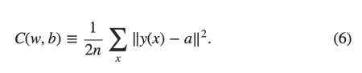
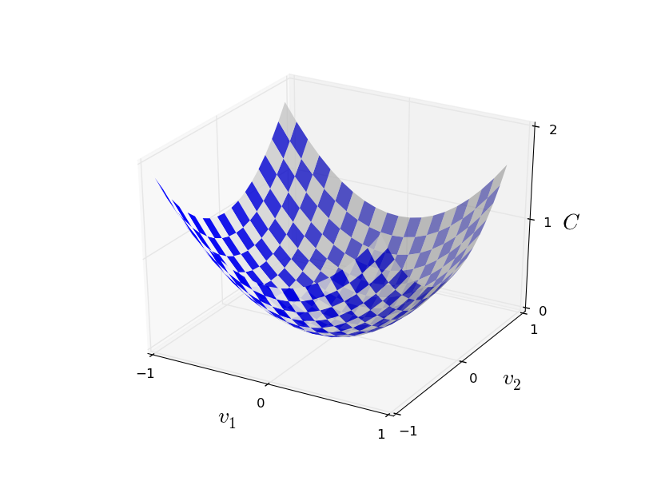
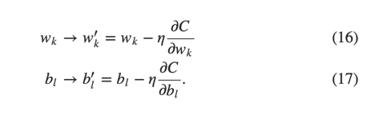
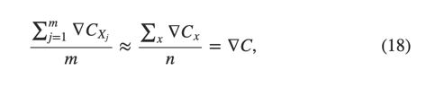

"plugins": [
    "katex"
]

## 学习梯度下降算法

我们设计了神经网络，那么如何使用它来学习识别数字呢？首先我们需要要给数据集来学习，叫做训练数据集。我们将使用MNIST数据集。它包含了数以万计的手机字体的扫描图片，并且进行了正确的分类。它来自于NIST(United States' National Institute of Standards and Technology 美国国家标准技术研究所)收集的两个数据集的子集，并进行了一些调整。这里是MNIST中的一些图片：

如你所见，实际上这正是我们在本章开头提到过的数字。当然，我们让网络识别训练集之外的图片，以此来测试我们的设计的网络。

MNIST包含了两个部分。第一部分6万个图片，作为训练数据。是由250个人的手写数字经扫描得到的，这些人中的一半来自于美国人口普查局的雇员，另外一部分是高中生。图片为$$28 x 28$$像素的灰阶数据。MNIST的第二部分包含1万张图片，用作测试图片。同样是$$28 x 28$$像素的灰阶。测试数据用来评估神经网络识别数字的准确率。为了保证测试的准确性，测试数据来自于另外250个人(仍然来自于人口调查局和高中生)。这样就可以保证我们我的系统可以识别训练集以外的人写的数字。

&nbsp 我们将使用符号x代表一个训练集输入。每一个输入训练集x包含了$$28 x 28 = 784$$个维度的向量。向量的每一个实体值代表了一个图片像素的灰度值。将我们期望的输出表示为$$y=y(x)$$，y是一个10维的向量.例如，如果一个训练图片x，代表了数字6，$$ y(x)= (0,0,0,0,0,0,1,0,0,0)^T$$是我们期望的输出结果。这里T是个转置操作，他把一个行向量转换为列向量。

&nbsp &nbsp我们希望算法能够帮助我们找到合适权重和偏移量，这样对于每一个训练输入x，神经网络的输出都无限接近与y(x).为了评估我们距离这个目标有多远，我们定义了一个cost函数：

$$
C(w,b)=\frac{1}{2n}\sum_{x}^{  }{ \left \| y(x) - a \right \|}^{2} \qquad \qquad \qquad （6）
$$

这里，w代表网络中所有的权重，b代表所有的偏移量，n是输入的数量，sum对所有的输入x进行求和。当然，输出a取决于x，w和b，为了保持表达式的简单，我不会特别强调其中的关联性。标记 $$\left \\| v \right \|$$只是代表向量v的长度。我们把C称之为二次成本函数。有时我们也称之为聚方误差，简称为MSE。观察二次方差成本函数，我们会看到$$C(w,b)$$是个非负数，因为求和的所有项都是非负数。进一步，如果对于所有的输入x，如果y(x)与输出结果a都十分接近时，$$C(w,b)$$就会很小，甚至约等于0.如果能够找到合适的权重和偏移量，是的最终的$$C(w,b)$$约等于0，这就说明我们的训练算法非常出色。相反，如果$$C(w,b)$$的值很大，这意味着$$y(x)$$与输出结果a并不接近。所以，我们训练算法的目的是最小化$$C(w,b)$$。话句话说，我们的目的是找到最合适的一组权重和一组偏移值，使得成本函数尽量小。我们将使用梯度下降算法来解决这个问题。
  为什么要接受二次成本呢？毕竟我们关心的只是网络是否可以正确地对数字图片进行分类。为什么不直接想办法尽量最大化这个数字，反而去最小化它的代理量度二次成本呢？原因是，在网络中，正确分类后的数字并不是权重和偏移值平滑函数。大多数时候，对权重和偏移量的微小调整，对网络的输出结果(分类出的数字)不会产生任何影响。这样就难以通过调整偏移量和权重来进行不断优化了。而如果用二次成本函数，是可以知道如何通过对权重和偏移量进行微小的变化来不断降低成本的。因此，我们会聚焦于如何最小化二次成本函数，以此来检验分类的准确性。
  即便如此，你可能还在想为什么会选择二次成本函数。这难道不是一个临时安排的选择吗？如果我们选择其他的成本函数，我们是否可能得到一个完全不同的最小化的权重和偏移值的集合？这是一个有价值的问题，稍后我们会重新审视这个成本函数，并做一些优化。不过，二次成本函数有助于我们理解神经网络学习的基本原理。我们会先用这个函数。
  重复一下，我们训练神经网络的目的是找到权重和偏移量的集合，使得二次成本函数$$C(w,b)$$的值最小化。这是一个适定问题，不过它带来了很多杂乱的元素，w代表权重和b代表偏移量，如何理解？一致萦绕着我们的σ函数，如何选择网络的结构，MNIST，等等。实际上，只需聚焦于最小化的角度，即使忽略掉它的结构，我们也能理解一个极大的数量。从现在开始，让我们忘掉成本函数具体等式，甚至神经网络之间的连接，等等。只需要理解，我们有一个包含有很多变量的函数，我们想最小化这个函数。我们将引入一个叫做梯度下降的技术来解决这个这个函数的最小化问题。如何，我们再重新审视这个神经网络想最小化的二次成本函数。
  
   现在我们试图最小化一个函数$$C(v)$$。这可以是任何一个实数数值的函数，它包含了很多变量，$$v=v_1，v_2，... $$ 我们把w和b替换为v来强调这可以使任意函数。我们不再考虑神经网络场景下的情况。为了最小化$$C(v)$$,可以先考虑C拥有两个变量，称作$$v_1$$和$$v_2$$：

我们希望找到在哪里C可以达到整体的最小值。很明显，我们只需要看一眼上图，就知道最小点在哪里。可能是因为我们展示的函数太简单了，实际上，C可能是一个包含许多变量的复杂函数，这个时候几乎不可能看一下图片就能够找到最小值。
  一个方法是利用微积分通过解析法找到最小值。我们可以计算导数，如何用他们来找到C的极值。幸运的是，通过这个方法，当C包含少数几个变量时，这个方法是可行的。但是当它包含非常多的变量时，将会是一个噩梦。不幸的是，神经网络中，我们总是期望更多的变量。一些最大的神经网络中，极端复杂的情况下成本函数甚至取决于十亿级权重和偏移量。这种情况下，微积分是不可行的。
  （刚刚声明过我们可以通过拥有两个变量的函数C来了解它，我就在接下来的两段文字中翻转了两次：“如果函数有超过2个变量呢？”真的很抱歉。请相信我，把C函数想象做两个各变量的函数确实对我们有理解起来有帮助。只是，有些情况下会出现一些意外情况，上面两段就是在处理这些问题。好的数学思维往往包括在多个直观的图片之间切换，并学习什么时候使用哪张图片，什么时候不使用。）
   总之，微积分是行不通了。幸运的，有一个聪明的类比启发我们了一个特别溜的算法。可以把函数想想为一个山谷，如果你只是把它很小的一部分在坐标轴中画出来，并不算困难。想想一下，如果一个球顺着上坡往下滚动。直觉上我们会知道，小球会最终滚到山谷的底部。或许我们可以使用这个方法来找到函数的最小值。我们随机地为小球去一个初始点，然后模拟小球向下滚动直至达到山谷的底部。我们可以通过计算导数来模拟这一过程。这并不困难。这些导数可以告诉我们山坡在当前点附近的形状，因此我就知道小球改如何滚动了。
  你可能会认为，我们要开始为小球写牛顿运动定律了，要考虑到重力和摩擦的因素。实际上，我们不会太把整个类比当回事，也不必精确模拟整个物理定律，只是利用这个算法来最小化C就可以了。小球的观点目的是帮助我们想象，而不是限制我们思考。所以，不必陷入到复杂的物理学细节，我们只用简单问我们自己：如果我们做一天上帝，可以自己制定物理学定律，指挥小球滚动，我们会怎么选择定律让小球棍乡谷底呢？
  为了更准确描述中这个问题，让我们想象一下，当我们把小球在$$v_1$$方向上移动一点点$$\Delta v_1$$，在$$v_2$$方向上移动一点点$$\Delta v_2$$，微积分告诉我们C的变化如下：

$$
 \Delta C \approx \frac{\partial C}{\partial v_1}\delta v_1 + \frac{\partial C}{\partial v_2}\delta v_2 \qquad \qquad \qquad  (7)
$$

我们的目标是找到合适的$$v_1$$和$$v_2$$，使得$$\Delta C$$是负值，这样我们就可以选择这个$$v_1$$，$$v_2$$来让小球往谷底滚动。如果进入向量$$\Delta v$$作为向量v的一个小变化，$$\Delta v ≡ ( \Delta v_1,\Delta v_2)^T$$，这里T是转置函数，它把行向量转换为列向量。C的导数也可以定义为向量的偏导数$$\left ( \frac{\partial C}{\partial v_1},\frac{\partial C}{\partial v_2} \right )^T$$。我们将向量的导数记做$$\triangledown C$$，那么：

$$
$$\triangledown C$$ ≡ \left ( \frac{\partial C}{\partial v_1},\frac{\partial C}{\partial v_2} \right )^T \qquad \qquad \qquad   (8)
$$

等一下，我们将通过$$\Delta v$$、$$\Delta C$$以及$$\triangledown C$$来重写这个等式。不过，由于这个导数会对很多人造成困扰的，我将首先讲明这一点。第一次看到$$\triangledown C$$这个符号，很多人会琢磨，这个符号∇到底应该怎么理解呢？∇这个符号到底意味着什么？其实，你把它当做一个数学符号就足够了---一个上述定义的向量，它由两个符号构成。这样看，∇就仅仅是一个符号而已。他只是在告诉你，“$$\triangledown C$$是一个向量导数”。 当然，从一些更加高级的视角来看，$$\triangledown C$$也可以被当做是一个独立的数学概念(例如，作为一个微分算子)，不过，我们不需要这么看。
  基于以上定义，表达式(7)可以重写为：

$$\Delta C$$≈$$\triangledown C$$⋅$$\Delta v$$ (9)

$$
\Delta C \approx \triangledown C . \Deltav \qquad \qquad \qquad  (9)
$$
这个等式解释了为什么$$\triangledown C$$被成为导数向量：$$\triangledown C $$取决于v的变化继而改变了C，这很符合导数的定义。更加有让人兴奋的是，这帮助我们找到了让$$\Delta C$$成为负值的方法。加入我们选择

$$\Delta v$$=−η$$\triangledown C$$  (10)

$$
\Delta v = -\eta \triangledown C, \qquad \qquad \qquad  (10)
$$

这里$$\eta$$是一个小的正的参数(称作学习率)。图(9)中的等式告诉我们：$$\Delta C \approx  - \eta \Delta C⋅\triangledown C \equal −\eta \left \| \triangledown C\right \|^2$$。由于$$\left \| \triangledown C \right \|^2 \geq 0$$，所以$$\Delta C \leq 0$$。如果我们根据等式(10)的改变v，就可以保证C永远在减少(也基于等式9中的无限趋近)。 这恰好是我们所需要的。所以我们将等式10定义为我们梯度下降算法中，小球运动的定律。我们用等式10中的定义来计算$$\Delta v $$的数值，如何把小球的位置v移动这么多($$\Delta v $$)：

 v→v′=v−η$$\triangledown C$$.(11)
 $$
v \rightarrow {v}' = v - \eta \triangledown C. \qquad \qquad \qquad  (11)
 $$

然后我们再次应用这个更新后的定律，来进行下一次移动。我们持续不断地这么做，一次又一次，我们就可以不断得减少C，直至到达最低点。
  总结一下，梯队下降算法工作的原理是通过不断计算导数$$\triangledown C$$，然后使之向相反的方向移动，顺着山坡往下移动。视觉化起来就像下图：

请注意，梯度下降本身并不会产生真实的物理位移，现实物理世界中，小球拥有动能，这样小球就可以顺着斜坡移动，甚至滚到小山坡上。也是因为这个动能，即使在各种摩擦的影响下，小球也能够向山谷的地步运动。相反，我们的选择$$\Delta v$$的规则只是下降就行。不过这对于找到最小值来说，已经是足够好的规则了。
  为了让梯度下降工作起来，我们学习率η应该足够小，这样等式9才是一个好的近似值。否则，最终$$\Delta C$$可能会大于0，这就不妙了。同时，$$\eta$$也不能太小，因为这样$$\Delta v$$就太微小了，梯度下降算法运行起来就会慢得多。实际应用时η会不同的，为了保证好的近似值同时算法也不至于太慢。稍后我们会看到它是如何工作的。
  前述梯度下降算法中，C函数仅有两个变量。当C有更多的变量时，仍然是适用的。如果C函数拥有m个变量，$$v_1,...,v_m$$。 $$\Delta C$$的改变由$$\Delta v$$引起，$$\Delta v = (\Delta v_1,...,\Delta v_m)^T$$。

$$\Delta C$$≈$$\triangledown C$$⋅$$\Delta v$$,
$$
\Delta C \approx \triangledown C \dot \Delta v \qquad \qquad \qquad (12)
$$

这里$$\triangledown C$$是一个向量：

$$
\triangledown C \equiv \left ( \frac{\partial C}{\partial v_1},...,\frac{\partial C}{\partial v_m}\right)^T . \qquad \qquad \qquad (13)
$$

在两个变量的情况下，我们可以选择

$$\Delta v = −\eta \trigangledown C \qquad \qquad \qquad   (14)

这样可以保证等式(12)中的$$\Delta $$为负值。 这样一直沿着这个梯度下去，就可以得到一个最小值，即使当C有非常多的变量，只需要重复更新这个规则就可以了：

v→v′=v−η$$\triangledown C$$  (15)

$$
v \rightarrow {v}' = v - \eta \triangledown C. \qquad \qquad \qquad  (15)
$$

你可以认为这个更新的规则就是在定义梯度下降算法。通过这种方法，只要重复地改变V的位置，就可以找到C函数的最小值。这个规则有时候并不成立，可能会出现一些状况，梯度算法不能找到C函数的最小值，在稍后的章节中我们会讨论这一点。但是，大部分时候，梯队下降算法工作得非常好。在神经网络中我们会发现这是一个十分有用的最小化代价函数的方法。这样就可以帮助网络学习。
   实际上，我们甚至可以意识到在寻找最小值时，梯度下降算法甚至是最优的算法。假如我们想让$$\Delta v$$沿着C下降最多的地方移动。这等同于最小化$$\Delta C \approx \triangledown C \ dot \Delta v$$。我们将会限制移动的大小，这样$$\left |\ \Delta v\right |\ = \epsilon$$ 就是一个小的确定数:$$ \epsilon >0$$。也就是说，通过一个小的固定大小的移动，我们希望找到能够让C减小最多的那个方向。可以证明的是，最小化$$\triangledown C \dot \Delta v$$时选择的$$\Delta v$$ 其实等于 $$-\eta \triangledown C$$，这里$$\eta = \frac{\epsilon}{\left \| \triangledown C\right \|}$$取决于 $$\left \| \Delta v \right \| = \epsilon$$的大小约束，所以，梯度下降可以认为是不断向减少C最多的方向前进一小步的过程。

## 练习

* 证明最后一段的推断。提示：如果对你不太熟悉[柯西-施瓦茨不等式](http://en.wikipedia.org/wiki/Cauchy–Schwarz_inequality)，先熟悉一下它会有些帮助。
* 我解释了当C函数有两个和多个变量时的梯度下降算法，当C是只有一个变量时是怎么样的呢？你看通过几何学的方法来解释此时的梯度下降算法是怎么样的吗？

人们研究过很多梯度下降的变形算法，包括更加接近似于模仿真实物理小球的梯度下降。模仿小球的变形算法有一些优势，但也有一个明显的缺点，必须计算C的二次偏导数，这会是否消耗计算资源。假如我们打算计算二次偏导数：$$\frac {\partial ^2 C}{\partial v_j \partial v_k}$$。如果有100万个$$v_j$$变量，那么我们就需要计算1000亿个(100万的平方)二次偏导数。计算量代价非常高。好在，有方法避免这个问题，寻找梯度下降的替代方法也是一个活跃的研究领域。此书中，我们将使用梯度下降算法作为神经网络学习的主要方法。
  
在神经网络中如何运用梯度下降呢？方法是通过梯度下降方法来找到权重$$w_k$$和权重$$b_l$$来最小化等式6中的代价函数。为了说明它是如何工作的，我们得重申一下梯度下降的更新规则。首先，使用权重和偏移量替换掉变量$$v_j$$。换言之，我们的位置有两个部分组成，$$w_k$$和$$b_l$$，所以$$\triangledown C$$有两个对应的部分组成$$\frac{\partial C}{\partial w_k}$$和$$\frac{\partial C}{\partial b_l}$$。 替换元素后的后的梯度下降如下：

$$
w_k\rightarrow {w_k}' = w_k -\eta \frac{\partial C}{\partial w_k} \qquad \qquad \qquad  (16)
$$

$$
b_l\rightarrow {b_l}' = b_l -\eta \frac{\partial C}{\partial b_l} \qquad \qquad \qquad  (17)
$$

重复应用以上更新规则，就可以从“上坡上滚下来”了，这样我就可以得到一个最小值。换言之，这是在神经网络中可以使用的学习方法。

在应用梯度下降算法时，有几个挑战。我们会在稍后几章中详细探讨。为了理解问题在哪里，我们回头看一下等式(6)中的二次代价函数。注意到这个代价函数的形式为$$C = \frac {1}{n} \sum_{x} C_x$$，它是每一个训练样本代价函数$$C_x \equiv \frac {\left \| y(x) - a \right\|^2}{2}$$ 的平均值。实际应用中，为了计算$$\triangledown C$$的导数，需要计算每一个训练输入x对应$$\triangledown C_x$$的导数，然后取他们的平均值，$$\triangledown C = \frac {1}{n}\sum_x\triangledown C_x$$。 不幸的是，当训练集数量很大的时候，这将耗费非常多的时间。
  一个加速学习的办法，称为随机梯度下降算法。方法是从训练集中随机选择一个小样本，然后计算小样本的$$\triangledown C_x$$。通过计算这个小样本的平均值，可以快速得到真正$$\triangledown C$$导数的良好近似值。这样就可以加速梯队下降算法的执行，继而提升学习的效率了。
  下面详细讲一下随机梯队下降算法。从训练样本中随机选取了m个小样本数据，把这m个样本编号为$$X_1，X_2,..., X_m$$,并称之为mini-batch(迷你小队)。前提是样本量m足够大，这样$$\triangledown C_x_j$$的均值接近于所有$$\triangledown C_x$$的均值。

$$
\frac {\sum_{j=1}^{m}\triangledown C_X_j }{m} \approx \frac {\sum_{x}{ } \triangledown C_x}{n} = \triangledown C \qquad \qquad \qquad  (18)
$$

上个式子中第二个求和是对所有训练集的求和。所以可以得到如下公式：

$$
 \triangledown C \approx \frac {1}{m} \sum_{j=1}^{m}  \triangledown C_X_j \qquad \qquad \qquad (19)
$$

这个等式再次验证了可以通过对随机选择的迷你小队求导来估算整体样本的导数。

下面我们将看一下如何在再神经网络学习中运用它。加入$$w_k$$和$$b_l$$代表神经网络中的权重和偏移量。随机梯度下降随机从学习样本中选择一个样本的迷你小队，然后通过对样本小队求导后求平均数。如下图：

 $$
w_k\rightarrow {w_k}' = w_k - \frac {\eta}{m} \sum_{j}^{ } \frac{\partial C_X_j}{\partial w_k} \qquad \qquad \qquad  (20)
$$

$$
b_l\rightarrow {b_l}' = b_l - \frac {\eta}{m} \sum_{j}^{ } \frac{\partial C_X_j}{\partial b_l} \qquad \qquad \qquad  (21)
$$

这里是使用的是对迷你小队训练集$$X_j$$求和。然后，我们通过随机的方法取另外一组迷你小队继续这个训练，不断重复这一过程，知道用尽了训练集，也就是我们用尽了一代训练集。然后，我们启动新的一代训练集。
  顺带提一句，实际应用中，代价函数和迷你小队训练集可能会和前述我们讨论的有些不同。在等式(6)中，我们增加因子($$\frac {1}{n}$$)来计算整体的代价函数。有时候，人们会忽略掉$$\frac {1}{n}$$这个因子，只是把所有的代价函数求和而不是求平均值。当训练集数量无法提前预知的情况下会非常有用，例如，当发生在训练数据会时时生成的时候。同样，有时，迷你小队计算时也会忽略掉$$\frac {1}{m}$$。概念上，这会造成一些影响，因为这意味着重新定义了学习率$$\eta$$。当对不同工作进行细致对比时，需要当心这一点。
  我们可以把随机梯度算法看做政治投票：做个民意调查也要比举行一次全民选举简单得多。举个例子，MNIST中，训练集的大小为n=6000，选择迷你小队为$$m=10$$，这意味着我们估算导数可以加速6000倍。当然，估算并不完美，存在统计波动。不过已经足够了。我们真正关心的是向减少C的方向移动，所以并不需要对导数计算那么精确。实际使用中，随机梯度下降是神经网络学习的一个重要技术， 使用很普遍，它是大多数此书中提到的神经网络学习技术的基础。
## 练习

* 梯度下降的一个极端例子是把迷你小队的大小设置为1.给定训练的输入为$$x$$，我们根据如下规则来更新权重和偏移量：
$$w_k \rightarrow {w_k}'- \eta \frac{\partial C_x}{\partial w_k}$$ 以及 $$b_l \rightarrow {b_l}'- \eta \frac{\partial C_x}{\partial b_l}$$.如何，我们选择另外一个训练集输入，继续更新权重和偏移量。循环下去。这个过程称为在线(online),或者递增式学习。此时，神经网络每次仅从一个训练输入中学习（这点和人类相似）。请思考一下，相对于选择的迷你小队数为5的随机梯度下降算法，这种学习方式的优点和缺点是什么，请分别举一个例子。

在梯度下降中，新手会经常犯一个错误，我们一次来总结这一章。神经网络中，代价函数C包含所有的权重和偏移量，这会是很多变量。所以，这意味着定义的曲面有非常多的维度。一些人总是忍不住思考，我得先办法把所有的维度视觉化起来。然后，就会焦虑起来。仅仅是想想一下4维空间就够头疼的了，更不用说五维了(想想500万维会怎么样)。是不是他们缺乏某种超级数学家拥有的技能呢？当然，答案是否定的。即使是专业的数学家也通常不能视觉化四维空间。他们使用的诀窍是，想办法找其他的途径来代表正在发生的事情。这其实也是我前面使用的窍门：我们使用了代数而不是视觉化来代表$$\Delta C$$，最终弄清楚了如何移动来减少C。善于在高维度空间思考的人们经常拥有一个脑力库，里面包含了许多许多不同的此类窍门。我们的代数化方法只是其中的一个例子。这些方法可能会比我们已经习惯的视觉化了的3为空复杂一些，不过，一旦你建立这些技术的库，你会就会非常善于在高维度空间思考。我们不会深入探讨这个话题，不过如果感兴趣，你可以阅读一下这个专业数学家在进行高位空间思考时所用到技术的讨论。当然，其中的一些相当复杂，不过其中的精华的大部分还是直观和容易理解的，大部分人都可以掌握。