"plugins": [
    "katex"
]


# 第一章：使用神经网络识别手写数字     
---

人类的视觉系统是世界的一个奇迹，下面是一串手写的数字


   人们可以轻松认出来这些数字是504192。非常简单。在我们大脑的每一个区域，人类有一个主要的视觉区，叫做$v_1$，它由14亿个视觉细胞构成，这些视觉细胞之间形成了百亿数量级的连接。人类的视觉系统不仅仅有$v_1$，还有$v_2$，$v_3$，$v_4$，和$v_5$. 它们一起组成了复杂的渐进式视觉处理系统。事实上，我们脑袋中有一台超级计算机，经过几亿年的进化和调校，形成了超常的视觉认知能力。实际上，识别手写字体绝非易事。我们人类在认知眼睛所看到的事物时时有着让人惊讶的能力。更神奇的是，整个识别的过程在我们无意识中就完成了。因此，我们经常忽视我们视觉系统这一超能力。

  但，当你准备用计算机程序来完成这一识别上述手写字体的过程时，就会感到十分困难。原本开起来对于我们来说易如反掌的事情突然变得极端困难。例如对9的识别，直觉上，9的特征是顶部一个圆圈，其下面是一个垂直的竖线，直达底部，这通过计算机算法描述起来却没这么简单。当你试图让这些特征精确起来，你会发现自己很快就迷失在无尽的特例和异常情况中。看起来简直不可能。

   神经网络试图从另外一个角度解决这个问题。方法是通过大量的手写字体也就是训练集(如下图)，构建一个可以学习这些训练集的系统。


也就是说，神经网络通过这些手写数字训练集自动找到识别它们的规律。然后，通过增加训练集的规模，神经网络可以学习更多手写体，逐渐提升识别的准确性。上面是100个训练集的例子，如果有一千个、一百万个甚至几十亿个训练集，我们可以构建一个更好的手写识别系统。
   这一张中，我们将写一个由计算机程序实现的神经网络，来识别手写字体。其实仅仅需要74行代码就够了，甚至不需要特殊的神经网络库。别小瞧这个神经网络，不需要人工干预，它的识别准确性就可达到96%。在后续的章节中，我们还会将它的识别率提升到99%。现实中最好的商业化神经网络已经足够好，银行已经在用它来识别支票，邮局用它识别地址。

   手写体的识别对于我们学习神经网络是一个非常棒的典型问题，后续我们也会聚焦在手写识别上。手写体识别有不是一个简单的问题，有一定的挑战性，但也不至于过于复杂而需要非常复杂的解决方案，也不需要海量的计算能力。此外，对于学习诸如深度学习一类的更高级一些的技术也有帮助。此书自始至终将不断回到手写体识别这个问题上来。后面，我们还将讨论如何将之应用到其它领域，例如计算机视觉、语音识别、自然语言的处理等等。

   当然，如果这一章的目的只是写一个能够识别手写字体的程序，这章将会非常短。我们还将涉及神经网络的相关的一些概念，包括两个重要的人工神经元(感知神经元和sigmoid神经元)，以及标准的神经网络学习算法，也就是梯度下降算法。我将着重解释为什么问题是这样解决的，帮助你建立神经网络的直观印象。除了我给大家介绍基本的机制之外，还需要进行更为深入的探讨。不过这对于你的更进一步理解会十分有帮助。这一章结束时，我们将了解到什么是深度学习，以及它的重要性。

## 认知神经元

什么是神经网络？我们先解释下人工神经网络的一种，感知神经网络。1950 - 1960年代，受到Warren McCulloch 和 Walter Pitts的启发，科学家Frank Rosenblatt提出了感知神经网络的概念。今天，通常我们使用另外一种人工神经元，名字为sigmoid神经元。这本书也将重点探讨这种神经元。很快我们就将开始探讨它。不过，为了理解为什么sigmoid神经元被定义为他们的样子，我先介绍一下感知神经元(perceptrons).

perceptrons是如何工作的呢？一个perceptrons有数个二级制的输入$x_1$,$x_2$,...，处理结果是一个二进制的输出:


这个例子中，perceptrons有三个输入，$x_1$,$x_2$,$x_3$，实际上，输入可能会更多或者更少。Rosenblatt提出了一个计算输出的简单规则。他引入了weights权重的概念，$w_1$,$w_2$,...，每个权重是一个实数，它代表了每个输入因素对输出结果的影响程度。神经元的输出，0或1，取决于权重w与i相乘然后求和($sum{jw_jx_j)的结果，如果大于某个阈值，则为1，否则为0.阈值是神经元的一个参数，它也是实数。可以用更精确一些的算法表示如下：


这就是一个perceptron是如何工作的。

这是一个很基础的数学模型。你可以一个perceptron看做是装置，它通过衡量凭据及其权重来进行决策。举个不太现实但容易理解的例子，稍后我们将举个更为现实的例子。周末就要来了，你听说你所在的城市将举行一个芝士节活动。你非常喜欢吃芝士，正在考虑是否要参加。你会考虑三个因素：

1. 天气是否晴朗
2. 你的女朋友/女朋友是否也愿意去
3. 地点公共交通是否便利(你不开车)

用三个变量来代表这三个因素：$x_1$,$x_2$和$x_3$。比如如果天气不错，$x_1$ = 1；如果$x_1$ = 0，就以为这天气很糟糕。同样，$x_2$ = 1 意味着你女朋友/女朋友愿意去， $x_2$ = 0为不愿意。$x_3$同样。
现在加入你是只是的狂热爱好者，即使交通不便利，你女朋友/女朋友也不愿去，你还是会高高兴兴参加。但你非常讨厌糟糕的天气，如果天气不过，你绝对不会去。你可以使用perceptron来构建你的决策模型。其中一个办法是设代表天气的$w_1$设为6，其它两个因素 $w_2$ = 2， $w_3$.$w_1$的值很高，意味着天气对你的决策影响很大，远远超过另外两个因素。若你选择的阈值为5，则最终如果天气好，最终输出的结果就会大于1，相反，只要天气不好，结果就为0.输出的结果与你女朋友/男朋友愿不愿意去或者交通是否方便并没有关系。

   调整权重和阈值，可以得到不同的决策模型。例如，如果阈值设置为3，无论天气好与坏，或者举办地点交通很便利且你女朋友/男朋友愿意去，perceptron将最终决定你是否参加芝士节。就变为了一个不同的决策模型。降低阈值则意味着你更愿意参加芝士节。
   
   很明显，perceptron不是一个完整的人类决策模型，我们仍然可以清楚看到perceptron如何通过对各个因素施加权重来进行决策的。不过，看起来，通过一个复杂的perceptrons网络做细致的决定似乎是可行的。


   在这个网络中，perceptrons的第一列（第一层perceptrons）通过对输入设置权重，做了3个简单的决定。那perceptrons第二层会怎么做呢？第二层的perceptrons都会将第一层的perceptrons的输出作为输入，配以权重后，得出自己的结果。这样，相对于第一层的perceptrons，第二层的perceptron能够做出更复杂更抽象的决策。第三层perceptron，更为甚之。这样下去，有许多层perceptron构成的网络就可以做出复杂的决策。
    当我定义perceptron时我说过一个perceptron只有一个输出结果。在上述网络中，perceptron似乎有多个输出结果。事实上，它们仍然是单一输出结果。多个输出的箭头不过是为了方便我们理解一层perceptron的输出是其后层perceptron的输入而已。如果画一条输出线然后将它分为几节，会显得有些混乱。
   我们来简化一下perceptrons的描述。条件xxxx看起来蛮头疼的，我们可以用两个标记来改善一下。第一个改变是把xxx改为一个dot product，xxxx， 这里w和x是向量，分别代表权重和输入。第二个改变是把阈值挪到不等式的另外一边，并用perceptrons的bias来代替，b=-threshold. 使用偏移量替换到阈值，perceptrons规则就可以写作：


   你可以把偏移量理解为输出结果为1的难以程度。或者，如果用生物学术语，偏移量意味着让perceptron的难以程度。如果一个perceptrons有一个非常大的偏移量，perceptrons输出结果为1就非常容易。反之，如果为很大的负值，输出结果为1就变得十分困难。很明显，引入偏移量只是我们描述perceptrons时的一个小变化。稍后，我们将会了解到它是如何帮助简化符号。因此，本书中，我们将一直使用偏移量这个术语而不是阈值。
   
  我已经把perceptrons描述为通过权衡各个输入变量来进行决策。perceptrons的另外一个用途是用做数据计算的基础的逻辑函数，诸如AND，OR，或者NAND。 例如，一个perceptron有两个输入，每一个权重是-2，整体的偏移量是3，perceptrons是这样的：


输入若为00则输出为1，因为(−2)*0+(−2)*0+3=3为正数。这里，我引进了*符号以便使乘法更加明确。类似的，如果输入为01或者10，结果也是1.但如果输入为11则输出为0，因为 (−2)*1+(−2)*1+3=−1为负值。由此可见，perceptron实现了NAND门。
  NAND门的例子可以看出可以使用perceptron来计算简单的逻辑函数。事实上，我们可以通过perceptron网络来计算任意的逻辑函数。原因是NAND门是一个通用的计算式，任何计算都可以通过组合NAND门来完成。例如，我们可以通过NAND门组合建立一个电路，功能是完成$x_1$和$x_2$相加。这需要计算二级制的加法，$x_1$⊕$x_2$，同事，当$x_1$和$x_2$都是1时，carry bit被设置为1。也就是说，carry bit只是按位运算的$x_1$,$x_2$的结果。


用perceptron替换掉NAND可以得到一个同样功能的perceptrons网络，每个perceptron权重为-2，偏移量设置为3.于是一个决策网络诞生了。注意，为了方便画箭头，我把右下角的NAND门对应的perceptron移动了一点点。


另外一个值得注意的事情是，最左侧perceptron的输出两次被用作最底部perceptron的输入。在定义perceptron的时候，我可没说一个perceptron的输出不能同时两次被用作另外一个perceptron的输入。事实上，完全是可以的。但如果你真的不想这么做，也可以把两条线合并为一条线，然后把权重设置为-4就可以了。（如果还没有理解这是为什么，你应该停下来，花些时间弄明白它）。修改后的网络如下所示，所有未标出来的权重都为-2，所有的偏移量都为3，只有一个权重为-4：


我们一直把$x_1$和$x_2$当做变量画在perceptron 网络的左侧，但通常情况下，会在perceptrons网络的左侧在加一层--- 输入层，来放置输入。


如下标记只用作输入perceptron，他只有输出，没有输入。


简化了的符号而已。这不意味着它是一个没有输入的perceptron。为了看清这一点，假设一个perceptron没有输入，权重*参数求和则永远为零，那么，如果b>0,则perceptron的输出为1，否则，perceptron输出为0，这就说明perceptron的输出为一个固定的值，而非我们预期的值()。 最好别把输入perceptron当做真的perceptron，把它当做特殊的输出为预期值($x_1$,$x_2$,...)特殊单元好了。

上面加法的例子，可以出perceptrons网络是如何模拟包含多个NAND门的电路的。NAND门在计算中是通用的，因此，perceptrons网络也可以用作通用计算。
  perceptrons的计算通用性揖让人信心满满同时也多少有些让人失望。信心满满是因为perceptron网络可以像其他计算设备那样强大。但同时，让人沮丧的是，看起来perceptron也只是一种NAND门而已。这绝非是个大新闻。
  不过，实际情况好一些。我们可以设计一个学习算法来自动人工神经元网络的调整权重和阈值。无需程序员直接干预，只需要外部输入即可完成调整。通过这些学习算法，我们能够以一种完全不同于传统逻辑门的方法来使用perceptrons网络。不必把NAND或者其他门电路清晰布局出来，神经网络会自己学习如何解决这个问题，甚至是一些通过直接设计电路解决起来极端困难的问题。

## sigmoid神经元


学习算法听起来有些糟糕。不过，如果我们只是弄清楚如何在一个神经网络中使用这些算法呢？假如我们打算学习使用一个perceptron网络来解决一些问题。比如，神经网络的输入的数据是真实的黑白像素数据，来自于扫描过的手写数字图片。我们让网络能够自己学习其中的权重和偏移量，然后输出结果是能够正确地对输入的数字像素进行分类。为了弄明白网络是如何学习的，我们改变网络中的权重(偏移量也可以)一点点，我们期望的结果是，网络的输出会因此也发生一个对应的小变化。这使得学习成为可能。接下来我们会阐述这一点。下面的图示可以解释我们的需要是什么(显然这个简单的网络对于解决手写数字识别来说是不够的)。


假设对权重(或偏移量)做一个小的改变，则最终的输出的结果也只是发生一个小的变化，若假设成立，我们就可以利用这个机制，通过不断改变权重和偏移量来调整网络，网络将会按照我们期望的方式运行。举个例子，加入网络误将数字9误认为8，我们就可以通过微调权重和偏移量来让分类的结果更倾向是9。如果我们重复这一过程，反复调整权重和偏移量，我们将得到更准确的输出。网络就是这么学习的。

问题是，如果我们的网络包含了perceptrons，以上的机制就不灵了。实际上，无论是权重或者偏移量的微小调整，都可能导致最终输出结果的整个翻转，比如从0变为1.这个翻转将会使网络的其它部分发生完全的变化，整个过程会很复杂。尽管这个网络识别9的准确性提高了，识别其它数字的行为很可能被完全改变了，非常难以预测和控制。我们期望是通过权重或者偏移量的微小改变来让网络更接近于我们期望的方式工作，就变得十分困难了。或许会有其它更聪明的方法来绕过这个问题。但是如何让perceptrons完成学习并不是那么显而易见。
  我们可以通过引入一个新的人工神经元来克服这个问题---sigmoid神经元。他和perceptrons是类似的，不过做了优化调整，微小的权重或者偏移量的变化只会使输出产生一个小的改变。这是sigmoid神经元能够学习的一个关键特性。
  我来介绍一下sigmoid神经元，我们用描述perceptrons相同的方法来描述它。


和perceptrons一样，sigmoid神经元有输入$x_1$，$x_2$，...。 不过，这些输入并不一定是0或者1，其实可以是0和1之前的任意数字，比如0.638.这对于sigmoid神经元来说也是有效的输入。和perceptrons相同，sigmoid神经元的每一个输入都有对应的权重,$w_1$,$w_2$,...，以及总体的偏移量,b.只不过输出的结果不是0或1. 而是σ(w⋅x+b)。这里σ叫做sigmoid函数，特是这么定义的：

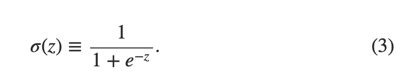

$\qquad \qquad \sigma (z) \equiv \frac{1}{1+e^{-z}} \qquad \qquad (3) $

为了更详细一些说明这一点，如果sigmoid神经元的输入是$x_1$,$x_2$,...，权重是$w_1$,$w_2$,...,偏移量是b，那么函数为：

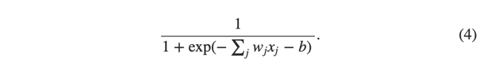

$\qquad \qquad \frac{1}{1+exp(-\sum_{j}^{ }w_jx_j-b)}    \qquad \qquad      (4)$

初看起来，sigmoid神经元和perceptron神经元差异非常大。如果不熟悉的话，sigmoid函数的代数表述方式看上去有些难以理解。事实上，两者之间有很多相似之处。sigmoid函数的代数方程式其实更多是技术细节，这并不会影响你理解它。
  为了理解与perceptrons模型的相似性，加入z≡w⋅x+b是一个大的正数，那么e−z≈0，所以σ(z)≈1。同样如果z≡w⋅x+b是一个很大的正数，sigmoid函数的输出为1，这点与perceptron相同。相反，如果如果z≡w⋅x+b是一个很大的负数，$ e^{-z} \rightarrow \infty $ ，所以 σ(z)≈0。所以，当z≡w⋅x+b是一个很大的负数，sigmoid神经元的也与perceptron相同。仅仅当w.x+b是一个之间的数值，才与perceptron模型不同。


σ的代数方程式是什么样的呢？我们该怎么理解？事实上，σ的确切代数方程式是什么并没有那么重要。重要的是这个函数的形状：


它是阶梯函数的平滑版本：

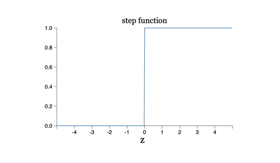

如果σ事实上是一个阶梯函数，那么sigmoid函数就会是一个perceptrons，因为输出的结果要么是0要么是1，取决于w⋅x+b是正数还是负数。通过使用σ函数，我们就得到了一个平滑的perceptrons。事实上，正是σ函数的平滑特性才至关重要，实际的细节公式反而不重要。正是由于σ函数平滑的特性，一个微小的权重上的变化$\Delta w_j $或者偏移量的变化$\Delta b $会导致神经元的输出$\Delta output$的微小变化。事实上，在微积分中，$\Delta output$趋向于以下函数：


xxxx[等式](5)
$\Delta output \approx \sum_{j}^{ }\frac{\partial output}{\partial w_j}\Delta w_j + \frac{\partial output}{\partial b}\Delta b $

这里sum是对所有的权重 $w_j$ 求和，∂output/∂$w_j$以及 ∂output/∂b是针对$w_j$和b分别部分求导。如果你对这个部分求导不太熟悉，也不必恐慌。尽管上面的表达式看起来有些复杂，包含多个部分倒数，它想表达的内容却很简单(绝对是一个好消息)：Δoutput对于Δ$w_j$和Δb来说是一个线性函数。正是受益于这个特征，通过选择小的权重和偏移量的改变来使输出往期望的方向上发生改变，便成为可能。所以，sigmoid函数不仅仅perceptrons诸多类似的特质，它也让通过对权重和偏移量做微小改变来使输出结果朝向预期的方向发生变化成为可能。
 
如果σ的形状很重要，而不是它确切的表达式，为什么还在图3中直接这个式子呢？稍后，这本书将不时将神经元的输出f(w⋅x+b)
用另外一个激活函数 f(⋅)？？？代替。当使用不同激活函数时，主要的变化在于图5中部分求导的值会发生变化。事实证明，当我们计算这些偏导数时，使用σ会简化代数式，因为对指数求导时会产生有趣的特性。不管怎样，σ在神经网络中的使用很广泛，也是我们这本书中使用最多的激活函数。
  我们该如何理解sigmoid函数的输出呢？很明显，它和percptrons的一个很大的区别是，其输出的结果并不仅仅是0或者1.实际上是0和1之间的任一实数，诸如0.173...和0.689，这些都是合法的输出。这会很有用，例如，如果我们想用输出的结果来代表神经网络的输入---图片的像素的强度。但有时，它也可能带来困扰。比如，我们想要的网络通过输出的结果来告诉我们输入的图片是否是9，如果输出结果是0或者1，会更加简单一些，像perceptron那样。实际应用中，我们可以设置一个约定来解决这个问题。例如，如果输入的结果大于0.5则意味着是9，否则，就不是9.如果用到类似的约定，我会明确指出来，所以不会对你产生困惑。

### 练习

* sigmoid神经元模拟perceptrons，第一部分如果我们把perceptron网络中所有的权重和偏移都乘以一个正的常数c, c>0.该网络的行为不会发生任何变化。
* sigmoid神经元模拟perceptrons，第二部分
  假如，我们有一个与上个问题同样设定的perceptron网络，假定，整体的输入已经选好了，不需要具体的输入值，只要已经选定下来了就好。假如对于网络中的任一perceptron的输入x来说，w⋅x+b≠0，现在把所有的perceptron用sigmoid神经元代替，然后将每一个权重和偏移量都同样乘以一个正值的常数C。当c→∞时，sigmoid神经网络的行为和perceptron的行为就完全一致。但当w⋅x+b=0时，却不成立。

## 神经网络的结构

这一节我们讲介绍一个神经网络，它能够很好完成手写数字的分类工作。作为准备，我们先介绍几个网络组成部分的术语。假如我们有如下的网络：


如前所述，最左侧的一层我们称之为输入层，其中的神经元称为输入神经元。最右一层为输出层，称为输出神经元，在此例中是一个单一的输出。中间的层称之为隐藏层，他们既不是输入层也不是输出层。隐藏这个词听起来有些神秘，我第一次听到这个术语，觉得它隐藏了很高深复杂的数学含义。不过，它真的只是意味着它既不是输入也不是输出。上面的网络只有一层隐藏层，但一些网络会有多层隐藏层。例如，下面网络有四层，其中两层是隐藏层。


有些难以理解的是，由于历史的原因，这类多层的网络有时候也被叫做多层perceptrons，简称做MLPs，尽管它完完全全由sigmoid神经元构成。在这本书中，我将不会使用MLP这个术语，因为它有些难以理解。当它出现时，我也会提醒你一下。

网络的输入和输出层是比较直观容易理解的。例如，假如我们打算来判断一张图片画的是不是数字9，一个自然而然的设计网络的方法是，把图片像素作为输入神经元。如果图片是64像素x64像素的灰阶图片，会有64*64=4096个输入神经元，每个神经元介于0和1之间。输出层只包含一个神经元，如果输出值小于0.5就意味着输入的图片不是数字9，高于0.5就是数字9。
  设计输入和输出层比较简单，然而，设计神经网络的隐藏层就是艺术了，你不可能通过几个简单的规则来概括隐藏层的设计过程。取而代之，神经网络研究员开发出了许多启发式的隐藏层设计方法，这些方法可以帮助人们让网络按照他们期望来行为。例如，其中的一些可以帮助在隐藏层基数与训练网络所消耗时间之间做权衡。在本书稍后章节中，我们会提到几个设计启发式。heuristics
   至此，一层的输出作为下一层的输入，我们一直在讨论这种神经网络，这类网络被称为种子向前神经网络。这意味着网络中没有循环---信息总是往前传递，从不倒回来。如果包含有循环，就意味着σ函数的输入取决于它的输出。这貌似没什么意义，所以我们不允许在网络中出现循环。
  不过，有些人工神经网络模型可能会出现反馈循环。这类模型称为循环神经网络。这些模型是想在神经元变得沉静之前，让它发射一段有限的时间。它的发射可以激发其它的神经元，然后这个被激发神经元也会发射一段有限的时间，这样就会导致更多的神经元开始发射，经过一段时间，我们就会得到神经元发射瀑布。这个模型中，循环不会造成问题，因为一个神经元的输出仅仅在一段时间之后影响它的输入，而不是同时。
  循环神经网络一致没有前馈神经网络这么有影响力，部分是因为循环神经网络的学习算法不够强大。不过，循环神经网络还是非常有趣的。相对于前馈神经网络，它们更加接近于人类大脑的工作机制，对于一些通过前馈神经网络解决起来极其困难的问题，循环神经网络却能够解决。这本书我们将着重介绍前馈神经网络。
  

## 一个简单的能够完成手写数字分类的网络

定义了神经网络，我们回头看下手写数字的识别问题。这个问题可以切分为两个子问题，首先，把包含有多个手写数字的图片分割为一系列的图片，每个图片只包含单个手写数字。如下：


拆开为6个单的手写字


人类轻松可以完成这个分段问题，但对于计算机来说仍然具有一定的挑战性。完成了图片的划分，第二问题是，程序需要将每张图片按照其上面的数字进行分类。例如，如果我们想让程序识别出第一个图片，数字5. 

 

  我们将聚焦在通过程序解决第二个问题。原因是，当你找到对单个数字进行分类的方法后，会发现对图片进行分段的问题并不是那么难了。其中一个可能的方法是，可以测试很多不同的图片分段方法，然后使用单个数字分类法来对每个分段方法打分。如果单个数字分类法在对所有分段进行分类时都很有信心，这分段方法就可以获得高分。相反，如果在对一个或多个分段进行分类时遇到了麻烦，就得低分，因为造成分类困难的原因很可能是我们分段选择错了。这个方法及其其它的变种可以很好地解决图片分段问题。所以，我们将聚焦于开发出一个神经网络来，以解决更加有趣和更难的问题上，名义上，识别单个手写数字。


输入层包含了由输入像素神经元编码而来的神经元，如前所述，网络的训练数据包含了许多28*28像素的手写数字扫描数据，所以，输入层包含了28*28=784个神经元。简化期间，我在上图中忽略了大部分神经元。输入像素为灰度，0.0代表白色，1.0代表黑色，之间的数值代表灰色的等级。

  第二层是隐藏层。我们把每个隐藏层神经元数量指定为n，后续我们将测试几个不同的n的数值。上面的例子描述的是一个小的隐藏层，它包含了15个神经元。

  输出层包括了10个神经元。如果第一个神经元发射了，比如输出约等于1，那么就表示网络认为数字为0.如果第二个神经元发射了就意味着网络认为数字为1.以此类推。为了精确期间，我们会对输出神经元从0到9进行编号，如何看那个神经元有最大的激活数值。如果这个神经元的编号是6，那么网络的猜测结果就是6.其它的输出神经元类似。

	你可能在想，为什么用10个输出神经元。毕竟，结果是要告诉我们0-9中那个对应于输入的图片。一个看起来自然的方法是仅使用四个输出神经元，每个神经元都当做一个比特的数值，这样组成了一个四位的二进制数。然后看每个神经元接近于0还是1，这样同样可以给出网络预测的结果。为什么要用10个输出神经元呢？会不会低效？最终的判定是通过实验完成的。这两种方法我们都可以去尝试，最终的结果是，对于这个问题而言，10个输出神经元要比4个神经元能够更好地学习识别数字。留给我们的问题是，为什么10个神经元会好一些。是否有一个启发式可以事前告诉我们我们应该用10个神经元而不是4个神经元。

	为了弄明白为什么这么做，这能帮助我们思考从第一条定律开始，神经元是如何工作的。考虑第一种使用10个神经元的情况。我们先聚焦于第一个输出神经元，它试图决定数字是否0。它通过从隐藏层中权衡每个输入来完成判断。这些隐藏层是做什么的？为方便讨论起见，假如隐藏层的第一个神经元探测是否存在下面的图片：


如果输入的像素与这张图片重叠的像素，就输入的像素赋予较重的权重，对其他输入赋予较低的权重。类似地，隐藏层的第二、第三和第四个神经元来决定下述图片是否存在。


你可能已经猜到了，这四张图片组成了数字0.


如果这四个隐藏的神经元都发射了，我们就可以认为数字是0. 当然，这不是唯一的得出数字为0结论的方法。实际上我们可以有需要其他的方法。但看起来在这种情况下，我们可以有信心地说我们认为输入的数字是0.

假如神经网络是这么工作的，我们就可以给出比较有说服力的解释，为什么10个输出要优于4个输出。如果我们有4个输出，第一个输出神经元需要通过输入的数字来决定最显著的比特是什么。但是，把上述简单的图形与最显著的比特关联起来，貌似没有特别容易的办法。很难想象一个数字的一部分是如何和最显著的输出比特关联起来的。
  
  现在，如前所述，这仅仅是基于现有经验得出的。刚才的例子中，隐藏层用来探测简单的图形形状，但这并不是说这个三层神经网络必须像我描述的这样工作。或许一个聪明的学习算法可以得出一种权重组合，这样我们就可以仅仅使用4个输出神经元。不过，基于启发式的思考方法，我已经能够很好地描述它的工作机制了，还能在设计好的神经网络时帮你节省很多时间。

## 练习

还是有办法通过二级制的方法表达一个数字的，只要在第三层的基础上增加一层就可以了。新增加的层把前一层的输出转化为二级制表达，如下图所示。假设第三层中数字正确的神经元输出值至少为0.99，否则最大为0.01. 请试着找到合适的权重和偏移量。


## 学习梯度下降

我们设计了神经网络，那么如何使用它来学习识别数字呢？首先我们需要要给数据集来学习，叫做训练数据集。我们将使用MNIST数据集。它包含了数以万计的手机字体的扫描图片，并且进行了正确的分类。它来自于NIST(United States' National Institute of Standards and Technology 美国国家标准技术研究所)收集的两个数据集的子集，并进行了一些调整。这里是MNIST中的一些图片：


如你所见，实际上这正是我们在本章开头提到过的数字。当然，我们让网络识别训练集之外的图片，以此来测试我们的设计的网络。

MNIST包含了两个部分。第一部分6万个图片，作为训练数据。是由250个人的手写数字经扫描得到的，这些人中的一半来自于美国人口普查局的雇员，另外一部分是高中生。图片为28*28像素的灰阶数据。MNIST的第二部分包含1万张图片，用作测试图片。同样是28*28像素的灰阶。测试数据用来评估神经网络识别数字的准确率。为了保证测试的准确性，测试数据来自于另外250个人(仍然来自于人口调查局和高中生)。这样就可以保证我们我的系统可以识别训练集以外的人写的数字。

&nbsp 我们将使用符号x代表一个训练集输入。每一个输入训练集x包含了28*28=784个维度的向量。向量的每一个Entry代表了一个图片像素的灰度值。将我们期望的输出表示为y=y(x)，y是一个10维的向量.例如，如果一个训练图片x，代表了数字6，y(x)= $(0,0,0,0,0,0,1,0,0,0)^{T}$是我们期望的输出结果。这里T是个转置操作，他把一个行向量转换为列向量。

&nbsp &nbsp我们希望算法能够帮助我们找到合适权重和偏移量，这样对于每一个训练输入x，神经网络的输出都无限接近与y(x).为了评估我们距离这个目标有多远，我们定义了一个cost函数：

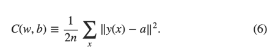

$C(w,b)=\frac{1}{2n}\sum_{x}^{  }{ \left \| y(x) - a \right \|}^{2}$

这里，w代表网络中所有的权重，b代表所有的偏移量，n是输入的数量，sum对所有的输入x进行求和。当然，输出a取决于x，w和b，为了保持表达式的简单，我不会特别强调其中的关联性。标记 ‖v‖只是代表向量v的长度。我们把C称之为二次成本函数。有时我们也称之为聚方误差，简称为MSE。观察二次方差成本函数，我们会看到C(w,b)是个非负数，因为求和的所有项都是非负数。进一步，如果对于所有的输入x，如果y(x)与输出结果a都十分接近时，C(w,b)就会很小，甚至约等于0.如果能够找到合适的权重和偏移量，是的最终的C(w,b)约等于0，这就说明我们的训练算法非常出色。相反，如果C(w,b)的值很大，这意味着y(x)与输出结果a并不接近。所以，我们训练算法的目的是最小化C(w,b)。话句话说，我们的目的是找到最合适的一组权重和一组偏移值，使得成本函数尽量小。我们将使用梯度下降算法来解决这个问题。
  为什么要接受二次成本呢？毕竟我们关心的只是网络是否可以正确地对数字图片进行分类。为什么不直接想办法尽量最大化这个数字，反而去最小化它的代理量度二次成本呢？原因是，在网络中，正确分类后的数字并不是权重和偏移值平滑函数。大多数时候，对权重和偏移量的微小调整，对网络的输出结果(分类出的数字)不会产生任何影响。这样就难以通过调整偏移量和权重来进行不断优化了。而如果用二次成本函数，是可以知道如何通过对权重和偏移量进行微小的变化来不断降低成本的。因此，我们会聚焦于如何最小化二次成本函数，以此来检验分类的准确性。
  即便如此，你可能还在想为什么会选择二次成本函数。这难道不是一个临时安排的选择吗？如果我们选择其他的成本函数，我们是否可能得到一个完全不同的最小化的权重和偏移值的集合？这是一个有价值的问题，稍后我们会重新审视这个成本函数，并做一些优化。不过，二次成本函数有助于我们理解神经网络学习的基本原理。我们会先用这个函数。
  重复一下，我们训练神经网络的目的是找到权重和偏移量的集合，使得二次成本函数C(w,b)的值最小化。这是一个适定问题，不过它带来了很多杂乱的元素，w代表权重和b代表偏移量，如何理解？一致萦绕着我们的σ函数，如何选择网络的结构，MNIST，等等。实际上，只需忽略那个结构，聚焦于最小化，我们就能理解一个极大的数量？？？。从现在开始，让我们忘掉成本函数具体等式，甚至神经网络之间的连接，等等。只需要理解，我们有一个包含有很多变量的函数，我们想最小化这个函数。我们将引入一个叫做梯度下降的技术来解决这个这个函数的最小化问题。如何，我们再重新审视这个神经网络想最小化的二次成本函数。
  
   现在我们试图最小化一个函数C(v).这可以是任何一个实数数值的函数，它包含了很多变量，v=$v_1$，$v_2$，。。。 我们把w和b替换为v来强调这可以使任意函数。我们不再考虑神经网络场景下的情况。为了最小化C(v),可以先考虑C拥有两个变量，称作$v_1$和$v_2$：

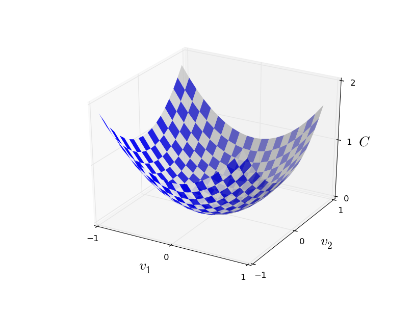

我们希望找到在哪里C可以达到整体的最小值。很明显，我们只需要看一眼上图，就知道最小点在哪里。可能是因为我们展示的函数太简单了，实际上，C可能是一个包含许多变量的复杂函数，这个时候几乎不可能看一下图片就能够找到最小值。
  一个方法是利用微积分通过解析法找到最小值。我们可以计算导数，如何用他们来找到C的极值。幸运的是，通过这个方法，当C包含少数几个变量时，这个方法是可行的。但是当它包含非常多的变量时，将会是一个噩梦。不幸的是，神经网络中，我们总是期望更多的变量。一些最大的神经网络中，极端复杂的情况下成本函数甚至取决于十亿级权重和偏移量。这种情况下，微积分是不可行的。
  （刚刚声明过我们可以通过拥有两个变量的函数C来了解它，我就在接下来的两段文字中翻转了两次：“如果函数有超过2个变量呢？”真的很抱歉。请相信我，把C函数想象做两个各变量的函数确实对我们有理解起来有帮助。只是，有些情况下会出现一些意外情况，上面两段就是在处理这些问题。好的数学思维往往包括在多个直观的图片之间切换，并学习什么时候使用哪张图片，什么时候不使用。）
   总之，微积分是行不通了。幸运的，有一个聪明的类比启发我们了一个特别溜的算法。可以把函数想想为一个山谷，如果你只是把它很小的一部分在坐标轴中画出来，并不算困难。想想一下，如果一个球顺着上坡往下滚动。直觉上我们会知道，小球会最终滚到山谷的底部。或许我们可以使用这个方法来找到函数的最小值。我们随机地为小球去一个初始点，然后模拟小球向下滚动直至达到山谷的底部。我们可以通过计算导数来模拟这一过程。这并不困难。这些导数可以告诉我们山坡在当前点附近的形状，因此我就知道小球改如何滚动了。
  你可能会认为，我们要开始为小球写牛顿运动定律了，要考虑到重力和摩擦的因素。实际上，我们不会太把整个类比当回事，也不必精确模拟整个物理定律，只是利用这个算法来最小化C就可以了。小球的观点目的是帮助我们想象，而不是限制我们思考。所以，不必陷入到复杂的物理学细节，我们只用简单问我们自己：如果我们做一天上帝，可以自己制定物理学定律，指挥小球滚动，我们会怎么选择定律让小球棍乡谷底呢？
  为了更准确描述中这个问题，让我们想象一下，当我们把小球在$v_1$方向上移动一点点Δ$v_1$，在$v_2$方向上移动一点点Δ$v_2$，微积分告诉我们C的变化如下：

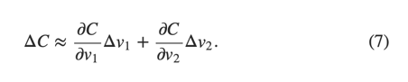


我们的目标是找到合适的$v_1$和$v_2$，使得ΔC是负值，这样我们就可以选择这个$v_1$，$v_2$来让小球往谷底滚动。如果进入向量Δv作为向量v的一个小变化，Δv≡(Δ$v_1$,Δ$v_2$)T，这里T是转置函数，它把行向量转换为列向量。C的导数也可以定义为向量的偏导数(∂C∂$v_1$,∂C∂$v_2$)T。我们将向量的导数记做∇C，那么：

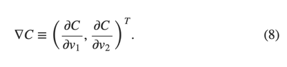


等一下，我们将通过Δv、ΔC以及∇C来重写这个等式。不过，由于这个导数会对很多人造成困扰的，我将首先讲明这一点。第一次看到∇C这个符号，很多人会琢磨，这个符号∇到底应该怎么理解呢？∇这个符号到底意味着什么？其实，你把它当做一个数学符号就足够了---一个上述定义的向量，它由两个符号构成。这样看，∇就仅仅是一个符号而已。他只是在告诉你，“∇C是一个向量导数”。 当然，从一些更加高级的视角来看，∇C也可以被当做是一个独立的数学概念(例如，作为一个微分算子)，不过，我们不需要这么看。
  基于以上定义，表达式(7)可以重写为：

ΔC≈∇C⋅Δv (9)

xxx
这个等式解释了为什么∇C被成为导数向量：∇C取决于v的变化继而改变了C，这很符合导数的定义。更加有让人兴奋的是，这帮助我们找到了让ΔC成为负值的方法。加入我们选择

Δv=−η∇C  (10)

这里η是一个小的正的参数(称作学习率)。图(9)中的等式告诉我们：ΔC≈−η∇C⋅∇C=−η‖∇C‖2。由于‖∇C‖2≥0，所以ΔC≤0。如果我们根据图(10)的等式选择v，就可以保证C永远在减少(也基于等式9中的无限趋近)？？？。 这恰好是我们所需要的。所以我们将等式10定义为我们梯度下降算法中，小球运动的定律。我们用等式10中的定义来计算Δv的数值，如何把小球的位置v移动这么多(Δv)：

 v→v′=v−η∇C.(11)


然后我们再次应用这个更新后的定律，来进行下一次移动。我们持续不断地这么做，一次又一次，我们就可以不断得减少C，直至到达最低点。
  总结一下，梯队下降算法工作的原理是通过不断计算导数∇C，然后使之向相反的方向移动，顺着山坡往下移动。视觉化起来就像下图：


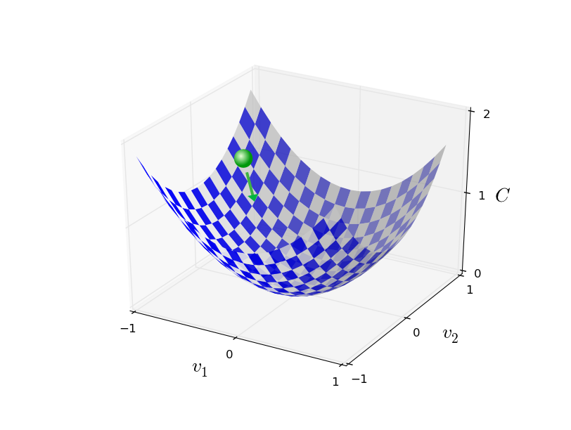


请注意，梯度下降本身并不会产生真实的物理位移，现实物理世界中，小球拥有动能，这样小球就可以顺着斜坡移动，甚至滚到小山坡上。也是因为这个动能，即使在各种摩擦的影响下，小球也能够向山谷的地步运动。相反，我们的选择Δv的规则只是下降就行。不过这对于找到最小值来说，已经是足够好的规则了。
  为了让梯度下降工作起来，我们学习率η应该足够小，这样等式9才是一个好的近似值。否则，最终ΔC可能会大于0，这就不妙了。同时，η也不能太小，因为这样Δv就太微小了，梯度下降算法运行起来就会慢得多。实际应用时η会不同的，为了保证好的近似值同时算法也不至于太慢。稍后我们会看到它是如何工作的。
  前述梯度下降算法中，C函数仅有两个变量。当C有更多的变量时，仍然是适用的。如果C函数拥有m个变量，$v_1$,...,vm. ΔC的改变由Δv引起，Δv=(Δ$v_1$,…,Δvm)T。
xxx


ΔC≈∇C⋅Δv,


这里∇C是一个向量：
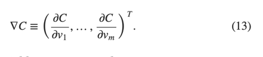


在两个变量的情况下，我们可以选择

Δv=−η∇C   (14)

这样可以保证ΔC为负值。这样一直沿着这个梯度下去，就可以得到一个最小值，即使当C有非常多的变量，只需要重复更新这个规则就可以了：

v→v′=v−η∇C  (15)

你可以认为这个更新的规则就是在定义梯度下降算法。通过这种方法，只要重复地改变V的位置，就可以找到C函数的最小值。这个规则有时候并不成立，可能会出现一些状况，梯度算法不能找到C函数的最小值，在稍后的章节中我们会讨论这一点。但是，大部分时候，梯队下降算法工作得非常好。在神经网络中我们会发现这是一个十分有用的最小化代价函数的方法。这样就可以帮助网络学习。
   实际上，我们甚至可以意识到在寻找最小值时，梯度下降算法甚至是最优的算法。假如我们想让Δv沿着C下降最多的地方移动。这等同于最小化ΔC≈∇C⋅Δv。我们将会限制移动的大小，这样‖Δv‖=ϵ就是一个小的确定数，ϵ>0。也就是说，通过一个小的固定大小的移动，我们希望找到能够让C减小最多的那个方向。可以证明的是，最小化∇C⋅Δv时选择的Δv是−η∇C，这里η=ϵ/‖∇C‖取决于 ‖Δv‖=ϵ的大小约束，所以，梯度下降可以认为是不断向减少C最多的方向前进一小步的过程。

## 练习

* 证明最后一段的推断。提示：如果对你不太熟悉[柯西-施瓦茨不等式](http://en.wikipedia.org/wiki/Cauchy–Schwarz_inequality)，先熟悉一下它会有些帮助。
* 我解释了当C函数有两个和多个变量时的梯度下降算法，当C是只有一个变量时是怎么样的呢？你看通过几何学的方法来解释此时的梯度下降算法是怎么样的吗？

人们研究过很多梯度下降的变形算法，包括更加接近似于模仿真实物理小球的梯度下降。模仿小球的变形算法有一些优势，但也有一个明显的缺点，必须计算C的二次偏导数，这会是否消耗计算资源。假如我们打算计算二次偏导数：∂2C/∂vj∂vk。如果有100万个vj变量，那么我们就需要计算1000亿个(100万的平方)二次偏导数。计算量代价非常高。好在，有方法避免这个问题，寻找梯度下降的替代方法也是一个活跃的研究领域。此书中，我们将使用梯度下降算法作为神经网络学习的主要方法。
  
在神经网络中如何运用梯度下降呢？方法是通过梯度下降方法来找到权重wk和权重bl来最小化等式6中的代价函数。为了说明它是如何工作的，我们得重申一下梯度下降的更新规则。首先，使用权重和偏移量替换掉变量vj。换言之，我们的位置有两个部分组成，wk和bl，所以∇C有两个对应的部分组成∂C/∂wk和∂C/∂bl。 替换元素后的后的梯度下降如下：
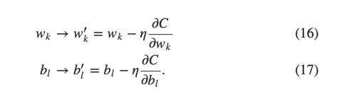

重复应用以上更新规则，就可以从“上坡上滚下来”了，这样我就可以得到一个最小值。换言之，这是在神经网络中可以使用的学习方法。

在应用梯度下降算法时，有几个挑战。我们会在稍后几章中详细探讨。为了理解问题在哪里，我们回头看一下等式(6)中的二次代价函数。注意到这个代价函数的形式为C=1n∑xCx，它是每一个训练样本代价函数Cx(Cx= ‖y(x)−a‖22)的平均值。实际应用中，为了计算∇C的导数，需要计算每一个训练输入x对应∇Cx的导数，然后取他们的平均值，∇C=1/n∑x∇Cx。不幸的是，当训练集数量很大的时候，这将耗费非常多的时间。
  一个加速学习的办法，称为随机梯度下降算法。方法是从训练集中随机选择一个小样本，然后计算小样本的∇Cx。通过计算这个小样本的平均值，可以快速得到真正∇C导数的良好近似值。这样就可以加速梯队下降算法的执行，继而提升学习的效率了。
  下面详细讲一下随机梯队下降算法。从训练样本中随机选取了m个小样本数据，把这m个样本编号为$x_1$，$x_2$，..., Xm,并称之为mini-batch(迷你小队)。前提是样本量m足够大，这样∇CXj的均值接近于所有∇CX的均值。

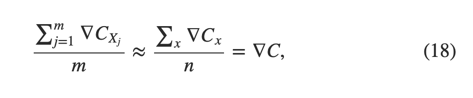

上个式子中第二个求和是对所有训练集的求和。所以可以得到如下公式：

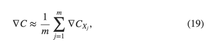

这个等式再次验证了可以通过对随机选择的迷你小队求导来估算整体样本的导数。

下面我们将看一下如何在再神经网络学习中运用它。加入wk和bl代表神经网络中的权重和偏移量。随机梯度下降随机从学习样本中选择一个样本的迷你小队，然后通过对样本小队求导后求平均数。如下图：

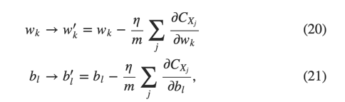

 

这里是使用的是对迷你小队训练集xj求和。然后，我们通过随机的方法取另外一组迷你小队继续这个训练，不断重复这一过程，知道用尽了训练集，也就是我们用尽了一代训练集。然后，我们启动新的一代训练集。
  顺带提一句，实际应用中，代价函数和迷你小队训练集可能会和前述我们讨论的有些不同。在等式(6)中，我们增加因子(1/n)来计算整体的代价函数。有时候，人们会忽略掉1/n这个因子，只是把所有的代价函数求和而不是求平均值。当训练集数量无法提前预知的情况下会非常有用，例如，当发生在训练数据会时时生成的时候。同样，有时，迷你小队计算时也会忽略掉1/m。概念上，这会造成一些影响，因为这意味着重新定义了学习率η。当对不同工作进行细致对比时，需要当心这一点。
  我们可以把随机梯度算法看做政治投票：做个民意调查也要比举行一次全民选举简单得多。举个例子，MNIST中，训练集的大小为n=6000，选择迷你小队为m=10，这意味着我们估算导数可以加速6000倍。当然，估算并不完美，存在统计波动。不过已经足够了。我们真正关心的是向减少C的方向移动，所以并不需要对导数计算那么精确。实际使用中，随机梯度下降是神经网络学习的一个重要技术， 使用很普遍，它是大多数此书中提到的神经网络学习技术的基础。
## 练习

* 梯度下降的一个极端例子是把迷你小队的大小设置为1.给定训练的输入为x，我们根据如下规则来更新权重和偏移量：
wk→w′k=wk−η∂Cx/∂wk 以及 b'l->bl=bl-η∂Cx/∂bl.如何，我们选择另外一个训练集输入，继续更新权重和偏移量。循环下去。这个过程称为在线(online),或者递增式学习。此时，神经网络每次仅从一个训练输入中学习（这点和人类相似）。请思考一下，相对于选择的迷你小队数为5的随机梯度下降算法，这种学习方式的优点和缺点是什么，请分别举一个例子。


在梯度下降中，新手会经常犯一个错误，我们一次来总结这一章。神经网络中，代价函数C包含所有的权重和偏移量，这会是很多变量。所以，这意味着定义的曲面有非常多的维度。一些人总是忍不住思考，我得先办法把所有的维度视觉化起来。然后，就会焦虑起来。仅仅是想想一下4维空间就够头疼的了，更不用说五维了(想想500万维会怎么样)。是不是他们缺乏某种超级数学家拥有的技能呢？当然，答案是否定的。即使是专业的数学家也通常不能视觉化四维空间。他们使用的诀窍是，想办法找其他的途径来代表正在发生的事情。这其实也是我前面使用的窍门：我们使用了代数而不是视觉化来代表ΔC，最终弄清楚了如何移动来减少C。善于在高维度空间思考的人们经常拥有一个脑力库，里面包含了许多许多不同的此类窍门。我们的代数化方法只是其中的一个例子。这些方法可能会比我们已经习惯的视觉化了的3为空复杂一些，不过，一旦你建立这些技术的库，你会就会非常善于在高维度空间思考。我们不会深入探讨这个话题，不过如果感兴趣，你可以阅读一下这个专业数学家在进行高位空间思考时所用到技术的讨论。当然，其中的一些相当复杂，不过其中的精华的大部分还是直观和容易理解的，大部分人都可以掌握。

## 应用网络，对数字进行分类

好吧，基于我们学习到的随机梯度下降算法，以及MNIST训练集，我们开始写一个程序来识别手写数字。仅仅短短的74行Python(2.7)代码就足够了。首先，我们需要获取MNIST数据。如果你是git用户，你可以通过拷贝下面的代码获取它：
`git clone https://github.com/mnielsen/neural-networks-and-deep-learning.git`
如果不是git的用户，你也可以在[这里](https://github.com/mnielsen/neural-networks-and-deep-learning/archive/master.zip)下载代码和数据。

顺便提一句，在介绍MNIST数据的时候，我说过它是由6万条训练图片和1万条测试图片构成的。这是个官方的定义。实际上，我的划分会少有不同。先不用管测试图片，把6万训练图片分文两部分，其中的5万条用作训练神经网络，另外1万条用作验证。这一章，我们不用用到验证数据，不过在后续章节中，当你会发现，当你试图弄清楚如何设置超级参数(hyper-parameters，例如学习率，这些参数我们的学习算法并不能直接选定)时,验证数据会十分有用。尽管MNIST原始文档中并没有验证数据这部分，许多人这样使用MNIST数据，在神经网络中使用验证数据也是非常普遍的做法。从现在开始，当我提到MNSIT数据时，我指的是5万图片集，而不是6万了。
   除此之外，我们还需要python的一个扩展库，叫做[Numpy](http://numpy.org/)来完成快速的线性代数计算。如果你还没装Numpy，可以从[这里](http://www.scipy.org/install.html)获得

解释一下神经网络代码的核心特性。核心模块是网络类，用来代表神经网络。下面是初始化网络这个对象的代码：

```
class Network(object):

    def __init__(self, sizes):
        self.num_layers = len(sizes)
        self.sizes = sizes
        self.biases = [np.random.randn(y, 1) for y in sizes[1:]]
        self.weights = [np.random.randn(y, x) 
                        for x, y in zip(sizes[:-1], sizes[1:])]

```

代码中，sizes列表代表的是对应层的神经元数量。例如，如果我们打算创建一个网络对象，第一层拥有2个神经元，第二层3个神经元，最后一层拥有1个神经元，那么网络代码如下：
` net = Network([2,3,1]) `
代码中的权重和偏移量都是随机的初始化值，Numpy np.random.randn函数生成了均值为0方差为1成正态分布的值。这个随机初始化是随机梯度下降的起点。后续章节中，我们会用到更好的初始化权重和便宜的方法，不过这个算法中我们先就这样。请注意，网络初始化代码假设第一层为输入层，所以没有设置偏移量，因为它只用在计算后续层的输出上。
  第二个需要注意的是，偏移量和权重存储在一个Numpy矩阵中。例如net.weights[1]存储的是第二层到第三层神经元之间的所有权重，(Python的列表索引号是从0开始的，所以他指的不是第一和第二层之间的权重)。net.weights[1]看起来有些啰嗦，它仅仅代表矩阵w。它仅仅是一个矩阵，矩阵中$w_j$k代表的是第二层的第K个神经元和第三层的第J个神经元之间的连接。j和k的顺序看起来有些奇怪。把j和k的顺序颠倒过来户不会更有意义一些？这么做的一个明显的好处是第三层神经元的激活向量是：
$ a′=σ(wa+b).(22) $


这个等式很有意思，我们拆开研究一下。a是第二层神经元的激活向量。为了得到a′，我们把a与权重向量x相乘，并且加上了偏移量矩阵b。如何，我们对向量wa+b中的每一个实体（Entry）求σ函数(称之为向量化σ函数)。很容易就可以看到，在计算sigmoid神经元的时候，等式22和等式4的结果是相同。


## 练习
* 使用单个实数(非向量)的方式来重写等式22，并且证明它与等式(4)的计算结果相同。

有了这些，就容易通过Network的实例写代码计算输出了。首先，定义一个sigmoid函数：

```
def sigmoid(z):
    return 1.0/(1.0+np.exp(-z))

```

这里z是是一个Numpy向量。Numpy以向量的形式逐个元素自动执行sigmoid函数。

如何，我们为网络类增加一个前馈函数，给定一个输入，计算出来对应的输出，对每一次执行等式22的计算。


```
 def feedforward(self, a):
        """Return the output of the network if "a" is input."""
        for b, w in zip(self.biases, self.weights):
            a = sigmoid(np.dot(w, a)+b)
        return a

```

当然，我们主要的目的是让网络类做学习。定义SGD函数来实现随机梯度下降算法。代码如下，一些地方看起来有些神秘，列完代码后，我们将分开讲解一下。

training_data是一个(x,y)的元祖列表。代表了训练输入和对应的输出。变量epochs和mini_batch_size分别代表了世代的数量和迷你小队的大小。eta是学习率。如果提供了可选的参数test_data，在每个世代训练结束，程序就会评估一次网络，并把进度打印出来。这对跟踪进度很有用，不过同时也拖慢了进度。
  顺着代码的执行，每个世代起始于随机打乱训练数据，如何选取一定数量放入mini-batches。这是一个随机选取训练数据的简便方法。如何，对每个mini_batch执行一步梯度下降。是通过这段代码完成的：self.update_mini_batch(mini_batch, eta)。仅用mini_batch，就可以通过一次迭代更新更新网络所有的权重和偏移量。下面是更新update_mini_batch的代码：

```
 def update_mini_batch(self, mini_batch, eta):
        """Update the network's weights and biases by applying
        gradient descent using backpropagation to a single mini batch.
        The "mini_batch" is a list of tuples "(x, y)", and "eta"
        is the learning rate."""
        nabla_b = [np.zeros(b.shape) for b in self.biases]
        nabla_w = [np.zeros(w.shape) for w in self.weights]
        for x, y in mini_batch:
            delta_nabla_b, delta_nabla_w = self.backprop(x, y)
            nabla_b = [nb+dnb for nb, dnb in zip(nabla_b, delta_nabla_b)]
            nabla_w = [nw+dnw for nw, dnw in zip(nabla_w, delta_nabla_w)]
        self.weights = [w-(eta/len(mini_batch))*nw 
                        for w, nw in zip(self.weights, nabla_w)]
        self.biases = [b-(eta/len(mini_batch))*nb 
                       for b, nb in zip(self.biases, nabla_b)]

```


大部分工作是这一行代码完成的：
`  delta_nabla_b, delta_nabla_w = self.backprop(x, y) `

这段代码激发了反向传播算法，它能够快速计算代价函数的导数。简单讲，update_mini_batch会计算迷你小队中每一个训练样本的这些导数，然后，正确地更新self.weight和self.biases.
我们先不详细讨论self.backprop的代码，下一章我们将详细讨论反向传播是怎么回事，到时候我会详细介绍这个行数的代码。现在，先假设它是这样工作的，它可以返回训练样本x对应代价函数的导数。
  现在我们看下整段代码，它包含了文档注释，我刚刚忽略了这部分内容。除了self.backprop，程序可以自我解释。正如前面提到过的，self.SGD和self.update_mini_batch完成了重任。self.backprop方法使用了一些其它的函数来完成导数的计算，包括sigmoid_prime，它计算了σ函数的导数；还有self.cost_derivative，这里先不做太多解释。看下文档注释或者代码就可以了解他们的大意(甚至是一些细节)。下一章我们会详细讲述这一部分。程序看起来有些长，这是因为为了方便理解，它包含了大量的文档的注释。实际上，除去空行和注释文字，代码只仅仅74行。这些代码可以从Github上获得[这里](https://github.com/mnielsen/neural-networks-and-deep-learning/blob/master/src/network.py)


```
"""
network.py
~~~~~~~~~~

A module to implement the stochastic gradient descent learning
algorithm for a feedforward neural network.  Gradients are calculated
using backpropagation.  Note that I have focused on making the code
simple, easily readable, and easily modifiable.  It is not optimized,
and omits many desirable features.
"""

#### Libraries
# Standard library
import random

# Third-party libraries
import numpy as np

class Network(object):

    def __init__(self, sizes):
        """The list ``sizes`` contains the number of neurons in the
        respective layers of the network.  For example, if the list
        was [2, 3, 1] then it would be a three-layer network, with the
        first layer containing 2 neurons, the second layer 3 neurons,
        and the third layer 1 neuron.  The biases and weights for the
        network are initialized randomly, using a Gaussian
        distribution with mean 0, and variance 1.  Note that the first
        layer is assumed to be an input layer, and by convention we
        won't set any biases for those neurons, since biases are only
        ever used in computing the outputs from later layers."""
        self.num_layers = len(sizes)
        self.sizes = sizes
        self.biases = [np.random.randn(y, 1) for y in sizes[1:]]
        self.weights = [np.random.randn(y, x)
                        for x, y in zip(sizes[:-1], sizes[1:])]

    def feedforward(self, a):
        """Return the output of the network if ``a`` is input."""
        for b, w in zip(self.biases, self.weights):
            a = sigmoid(np.dot(w, a)+b)
        return a

    def SGD(self, training_data, epochs, mini_batch_size, eta,
            test_data=None):
        """Train the neural network using mini-batch stochastic
        gradient descent.  The ``training_data`` is a list of tuples
        ``(x, y)`` representing the training inputs and the desired
        outputs.  The other non-optional parameters are
        self-explanatory.  If ``test_data`` is provided then the
        network will be evaluated against the test data after each
        epoch, and partial progress printed out.  This is useful for
        tracking progress, but slows things down substantially."""
        if test_data: n_test = len(test_data)
        n = len(training_data)
        for j in xrange(epochs):
            random.shuffle(training_data)
            mini_batches = [
                training_data[k:k+mini_batch_size]
                for k in xrange(0, n, mini_batch_size)]
            for mini_batch in mini_batches:
                self.update_mini_batch(mini_batch, eta)
            if test_data:
                print "Epoch {0}: {1} / {2}".format(
                    j, self.evaluate(test_data), n_test)
            else:
                print "Epoch {0} complete".format(j)

    def update_mini_batch(self, mini_batch, eta):
        """Update the network's weights and biases by applying
        gradient descent using backpropagation to a single mini batch.
        The ``mini_batch`` is a list of tuples ``(x, y)``, and ``eta``
        is the learning rate."""
        nabla_b = [np.zeros(b.shape) for b in self.biases]
        nabla_w = [np.zeros(w.shape) for w in self.weights]
        for x, y in mini_batch:
            delta_nabla_b, delta_nabla_w = self.backprop(x, y)
            nabla_b = [nb+dnb for nb, dnb in zip(nabla_b, delta_nabla_b)]
            nabla_w = [nw+dnw for nw, dnw in zip(nabla_w, delta_nabla_w)]
        self.weights = [w-(eta/len(mini_batch))*nw
                        for w, nw in zip(self.weights, nabla_w)]
        self.biases = [b-(eta/len(mini_batch))*nb
                       for b, nb in zip(self.biases, nabla_b)]

    def backprop(self, x, y):
        """Return a tuple ``(nabla_b, nabla_w)`` representing the
        gradient for the cost function C_x.  ``nabla_b`` and
        ``nabla_w`` are layer-by-layer lists of numpy arrays, similar
        to ``self.biases`` and ``self.weights``."""
        nabla_b = [np.zeros(b.shape) for b in self.biases]
        nabla_w = [np.zeros(w.shape) for w in self.weights]
        # feedforward
        activation = x
        activations = [x] # list to store all the activations, layer by layer
        zs = [] # list to store all the z vectors, layer by layer
        for b, w in zip(self.biases, self.weights):
            z = np.dot(w, activation)+b
            zs.append(z)
            activation = sigmoid(z)
            activations.append(activation)
        # backward pass
        delta = self.cost_derivative(activations[-1], y) * \
            sigmoid_prime(zs[-1])
        nabla_b[-1] = delta
        nabla_w[-1] = np.dot(delta, activations[-2].transpose())
        # Note that the variable l in the loop below is used a little
        # differently to the notation in Chapter 2 of the book.  Here,
        # l = 1 means the last layer of neurons, l = 2 is the
        # second-last layer, and so on.  It's a renumbering of the
        # scheme in the book, used here to take advantage of the fact
        # that Python can use negative indices in lists.
        for l in xrange(2, self.num_layers):
            z = zs[-l]
            sp = sigmoid_prime(z)
            delta = np.dot(self.weights[-l+1].transpose(), delta) * sp
            nabla_b[-l] = delta
            nabla_w[-l] = np.dot(delta, activations[-l-1].transpose())
        return (nabla_b, nabla_w)

    def evaluate(self, test_data):
        """Return the number of test inputs for which the neural
        network outputs the correct result. Note that the neural
        network's output is assumed to be the index of whichever
        neuron in the final layer has the highest activation."""
        test_results = [(np.argmax(self.feedforward(x)), y)
                        for (x, y) in test_data]
        return sum(int(x == y) for (x, y) in test_results)

    def cost_derivative(self, output_activations, y):
        """Return the vector of partial derivatives \partial C_x /
        \partial a for the output activations."""
        return (output_activations-y)

#### Miscellaneous functions
def sigmoid(z):
    """The sigmoid function."""
    return 1.0/(1.0+np.exp(-z))

def sigmoid_prime(z):
    """Derivative of the sigmoid function."""
    return sigmoid(z)*(1-sigmoid(z))

```


这段代码在识别手写数字的准确性上到底怎么样呢？我们导入MNIST数据看一下。将用到一个辅助程序，mnist_loader.py，稍后会介绍它。然后，我们在Phthon Shell中执行它：


```
>>> import mnist_loader
>>> training_data, validation_data, test_data = \
... mnist_loader.load_data_wrapper()

```


当然，你也可以在单独的Python程序中执行这段代码。不过在Python shell中，会简单一些。

导入数据之后，我们定义一个包含有30个隐藏层的Network。定义之前，需要引入上述Python程序。

```
>>> import network
>>> net = network.Network([784, 30, 10])

```


最后，我们使用随机梯度下降来学习MNIST 的training_data30个世代。迷你小队的大小设置为10，学习率η设置为3.0。

`>>> net.SGD(training_data, 30, 10, 3.0, test_data=test_data)`


这段代码执行起来需要一点时间，对于一个2015年通常的机器来说，需要几分钟。我建议你，开始运行之后，继续你的阅读，时不时看一下代码是否有输出就可以了。如果你赶时间，可以减少世代的数量，或者隐藏层的数量，甚至只用训练集的一部分数据。其实，最终的产品代码运行会非常快。Python代码目的是帮助你理解神经网络是如何运行的，没那么强调运行性能。网络训练好之后，可以运行得非常快，几乎在任何计算平台都是如此。得出一组好的权重和偏移量后，我们可以把它们运用在JavaScript中，这样就可以在网页、本地程序或者手机客户端中运行并得到结果。这里有一个训练输出的报告单。报告单展示了每个世代训练结束后，正确识别出的手写数字的数量。可以看到，完成一个世代的学习，就可以从10000个图片中正确识别出来9129个图片，随着世代的增多，识别成功的数量也在逐渐增加。

```

Epoch 0: 9129 / 10000
Epoch 1: 9295 / 10000
Epoch 2: 9348 / 10000
...
Epoch 27: 9528 / 10000
Epoch 28: 9542 / 10000
Epoch 29: 9534 / 10000

```
在第28世代分类成功率达到了最高值95.42%。这非常鼓舞人心。需要说明的是，当你运行这段程序时，你的结果可能和我的有所不同，那时因为我们为网络选择的初始化权重和偏移量不同。上面展示的是运行了三次中最好的结果。
  把隐藏层级修改为100，重新运行以上代码，这需要更长一段时间(在我的电脑上，每个世代的运行需要十秒左右)。如果你在阅读此段话的同时运行这段代码，在运行代码的同事，最好继续读下去。

```
>>> net = network.Network([784, 100, 10])
>>> net.SGD(training_data, 30, 10, 3.0, test_data=test_data)

```


这次可以把结果提升到96.59%。至少在这个案例中，提升隐藏层成功提升了运行结果。

为了获得这个精度，我指定了训练的世代数量、迷你小队的大小以及学习率。如前提到的那样，这些就叫做神经网络的超参数，是为了与其他学习算法学习到的参数(权重和偏移量)区别开。如果我们选择的超参数不太好，会得到差的结果。例如，我们选择学习率为η=0.001，


```
>>> net = network.Network([784, 100, 10])
>>> net.SGD(training_data, 30, 10, 0.001, test_data=test_data)
```


结果就会让人有些灰心：

```
Epoch 0: 1139 / 10000
Epoch 1: 1136 / 10000
Epoch 2: 1135 / 10000
...
Epoch 27: 2101 / 10000
Epoch 28: 2123 / 10000
Epoch 29: 2142 / 10000
```


不过，你会发现网络运行的效率在缓慢提升。这在暗示我们可以提升学习率，比如η=0.01.如果这么做，结果会有所改善，这意味着我们可以继续提升学习率。(如果改变后的结果更好，可以尝试做更多的改变)。如果我们继续做下去，我们会发现最终η=1.0(或许它比3.0更优质)，这和我们前面的测试十分接近了。可以看出，即使我们在一开始选择了不太好的超参数，我们也可以得到足够的信息来不断优化这些它们。

总体来说，调试神经网络十分具有挑战性。特别是当刚开始选择超参产生的结果还不足以覆盖随机噪声。假如，我们选取之前使用的30层隐藏神经网络，不过，把学习率设置为η=100.0：

```
>>> net = network.Network([784, 30, 10])
>>> net.SGD(training_data, 30, 10, 100.0, test_data=test_data)

```

这样，我们太过了，学习曲线太高了。


```
Epoch 0: 1009 / 10000
Epoch 1: 1009 / 10000
Epoch 2: 1009 / 10000
Epoch 3: 1009 / 10000
...
Epoch 27: 982 / 10000
Epoch 28: 982 / 10000
Epoch 29: 982 / 10000

```

想象一下，我们第一次遇到这个问题的时候。当然基于前面的实验，我们现在知道了应该减小学习率。不过第一次遇到的时候，我们可能不会从输出的结果来判断该怎么做。我们不仅仅会担心学习率，神经网络的所有部分我们都可能觉得有问题。会不是权重和偏移量初始化方式不对造成了学习特别困难？是训练集数量不够，所以无法得到正确的结果？或者世代不够？甚至整个神经网络压根就无法识别手写数字。抑或学习率太低了？太高了？第一次面对这个结果是，你会有些蒙圈。
  
  这里可以看到，神经网络的调试并不是件无足轻重的小事，和其它常规的编程一样，堪称艺术了。为了得到好的神经网络计算结果，你得学习这门艺术。你得积累如何选择高质量超参和高质量结构的技能。 这本书自始至终将会探讨这个问题。

## 练习

* 试着建立一个仅有两层构成的网络，一层是包含748个神经元的输入层，另外一层是包含10个神经元的输出层，没有隐藏层。如何使用随机梯度下降做训练，猜猜你将会得到什么分类结果？

前面，我们跳过了加载MNIST数据的过程，它还是比较直观的。完整起见，我还是把代码贴出来。存储MNIST数据的数据结构在文档注释中有描述。很直观，由元祖和Numpy narray对象列表构成(如果你对ndarrys不够熟悉，把他们当做向量集好了)。


``` 

"""

mnist_loader
~~~~~~~~~~~~

A library to load the MNIST image data.  For details of the data
structures that are returned, see the doc strings for ``load_data``
and ``load_data_wrapper``.  In practice, ``load_data_wrapper`` is the
function usually called by our neural network code.
"""

#### Libraries
# Standard library
import cPickle
import gzip

# Third-party libraries
import numpy as np

def load_data():
    """Return the MNIST data as a tuple containing the training data,
    the validation data, and the test data.

    The ``training_data`` is returned as a tuple with two entries.
    The first entry contains the actual training images.  This is a
    numpy ndarray with 50,000 entries.  Each entry is, in turn, a
    numpy ndarray with 784 values, representing the 28 * 28 = 784
    pixels in a single MNIST image.

    The second entry in the ``training_data`` tuple is a numpy ndarray
    containing 50,000 entries.  Those entries are just the digit
    values (0...9) for the corresponding images contained in the first
    entry of the tuple.

    The ``validation_data`` and ``test_data`` are similar, except
    each contains only 10,000 images.

    This is a nice data format, but for use in neural networks it's
    helpful to modify the format of the ``training_data`` a little.
    That's done in the wrapper function ``load_data_wrapper()``, see
    below.
    """
    f = gzip.open('../data/mnist.pkl.gz', 'rb')
    training_data, validation_data, test_data = cPickle.load(f)
    f.close()
    return (training_data, validation_data, test_data)

def load_data_wrapper():
    """Return a tuple containing ``(training_data, validation_data,
    test_data)``. Based on ``load_data``, but the format is more
    convenient for use in our implementation of neural networks.

    In particular, ``training_data`` is a list containing 50,000
    2-tuples ``(x, y)``.  ``x`` is a 784-dimensional numpy.ndarray
    containing the input image.  ``y`` is a 10-dimensional
    numpy.ndarray representing the unit vector corresponding to the
    correct digit for ``x``.

    ``validation_data`` and ``test_data`` are lists containing 10,000
    2-tuples ``(x, y)``.  In each case, ``x`` is a 784-dimensional
    numpy.ndarry containing the input image, and ``y`` is the
    corresponding classification, i.e., the digit values (integers)
    corresponding to ``x``.

    Obviously, this means we're using slightly different formats for
    the training data and the validation / test data.  These formats
    turn out to be the most convenient for use in our neural network
    code."""
    tr_d, va_d, te_d = load_data()
    training_inputs = [np.reshape(x, (784, 1)) for x in tr_d[0]]
    training_results = [vectorized_result(y) for y in tr_d[1]]
    training_data = zip(training_inputs, training_results)
    validation_inputs = [np.reshape(x, (784, 1)) for x in va_d[0]]
    validation_data = zip(validation_inputs, va_d[1])
    test_inputs = [np.reshape(x, (784, 1)) for x in te_d[0]]
    test_data = zip(test_inputs, te_d[1])
    return (training_data, validation_data, test_data)

def vectorized_result(j):
    """Return a 10-dimensional unit vector with a 1.0 in the jth
    position and zeroes elsewhere.  This is used to convert a digit
    (0...9) into a corresponding desired output from the neural
    network."""
    e = np.zeros((10, 1))
    e[j] = 1.0
    return e


```

前面我提到过程序的输出结果相当好。为什么？相对谁来说呢？如果有一个非神经网络的识别算法作为基线对比算法，那会很有帮助。最简单的基线对比算法是随机猜测数字。猜中的成功率是10%。对比来看我们的算法强太多了。

稍微高级一些的基线算法呢？举个比较极端的例子，对比图片的亮度。包含数字2的图片要比数字图片1更暗一些，因为2有更多的像素是黑色的：

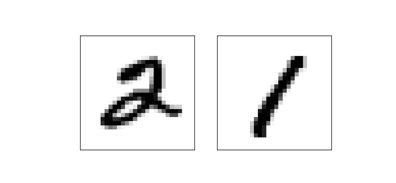

然后，使用训练数据，计算每一个数字的平均暗度，0,1,2,...,9. 给定一张图片时，我们只需要计算这张图片的暗度，然后猜测它最接近哪个数字的暗度。以此来猜测是哪个数字。这个过程很简单，代码也容易写，这里不再详细列出来。如果你感兴趣可以去github上看一下。虽然简单，相对于随机猜测却是一个巨大的进步，它可以在10000张图片中猜中2225张，也就是说正确率是22.25%.

即使找到准确率在20%和50%之间的算法也并不困难。如果在努力一下，甚至可以超过50%。如果想得到更高的正确率，就需要建立机器学习算法了。我们使用一个著名的算法，叫做支持向量机算法(support vector machine)，简称SVM.如果你对SVM不熟悉，没关系我们会使用一个Python的库，名字为 scikit-learn。 它为基于快速C语言库的SVM(LIBSVM)提供了一个简单的Python接口。

  我们使用默认设置运行SVM分类器，可以在10000个样本中得到9435个正确的结果。这里是代码。这又比简单对比图片暗度的方法先进了很多。甚至可以说，SVM的识别准确性可以和我们的神经网络相媲美。后续章节中，我们介绍优化我们神经网络的方法，使它就能够比SVM好多了。

不过，故事并未结束。9435个正确识别是基于SVM的默认算法。SVM有一些可调参数，你可以搜索到它们，用来优化提升它的默认性能。这里我就不详细讲述这点了。如果感兴趣你可以去看Addreas Mueller的博客。Mueller会给你看，如果SVM的参数调配得当，你可以得到98.5%的准确率。一个调校良好的SVM每识别70个数字的时候，才会出现一个错误。这相当好了。神经网络呢，可以做的更好吗？

当然可以了，目前，设计良好的神经网络在MNSIT识别上完胜其它所有技术，包括SVM。当前的最好的记录时在10000个图片成功分类9979个，这个记录是由Li Wan, Matthew Zeiler, Sixin Zhang, Yann LeCun, 和 Rob Fergus保持的。这本书的稍后部分，我们将看到大多数他们使用过的技术。这个识别准确率已经接近人类水平，在识别一些人类都觉得困难的MNIST图片时，准确率甚至更高。
  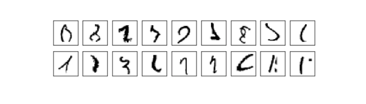
相信你也会觉得难以认出来。在MNIST图片集中类似的图片，神经网络可以从10000中的正确识别出来9979个，仅仅21个识别错误。正如解决识别MNIST手写数字这类困难问题 通常，在编程的时候，我们直觉认为算法会十分复杂。不过，即使在在前面所提到的Wan等人的论文中使用的神经网络，也仅仅包含了相当简单的算法和基于算法的变量，这些我们刚才都见到过了。某种程度说，他们的结果、我们的结果以及那些高级的论文，都说明了一个同样的问题：复杂的算法<=简单的学习算法+良好的训练数据

## 迈向深度学习

尽管我们的神经网络表现十分出色。不过这个表现多少有些神秘。权重和偏移量是自动发现的。这意味我们无法解释网络是如何完成的。有可能找到一种办法来理解神经网络分类手写数字的原则吗？如果有这些原则，我们是不是可以做得更好？
  为了让问题更明确一些，加入在几十年之前，神经网络还未用于人工智能。我们理解这类智能网络是如何工作的吗？由于权重和偏移量是自动计算出来的，我们无法理解，神经网络也会一直对我们神秘下去。在人工智能研究的初始阶段，人们希望在构建人工智能的同时，可以增进对智能背后规则的理解，这或许可以帮助理解人类大脑的运行机制。不过或许，结果却是，不仅仅仍然无法理解人类大脑是如何运行的，甚至连人工智能是如何运行的也仍然无法理解。
   为了说明这个问题，我们回头看下在这章开始的时候提到的人工神经元，它指的是掂量输入信息的权重。假如我们打算识别一张图片是否是人脸：


我们可以利用解决识别手写数字同样的方法来解决这个问题：把图片的像素作为神经网络的输入，网络的输出是单个神经元，代表是一张面孔或者不是。
 假如不用学习算法解决这问题，通过选择合适的权重和偏移量，手工建立一个网络，我们会怎么做？把神经网络丢在一边，我们可以选择的一个方法是把这个问题进行分解：这种图片的左上角有一只眼睛吗？右上角有一只眼睛吗？中间是否有一个鼻子？底部是否有一张嘴巴？顶部是否有头发？等等

如果其中几个问题的大案是肯定的，或者大概率是肯定的，我们可以得出结论，图片中包含面孔。否则，如果大部分大案是否定的，就不包含。

当然，这只是一个粗略的方案，有不少缺陷。比如一个人秃头，就没有头发，或者只能看到面孔的一部分，或者看到的是某个角度的面孔，有时候图片中的面孔特征比较模糊。不过，这个方案告诉我们，如果我们可以解决了神经网络的子问题，通过把这些子问题结合起来，或许就可以建立一个面部识别的神经网络。这里有一个可能的结构，每一个长方形代表一个子问题。请注意，它不一定是一个实际的解决方法，只是用来帮助我们理解网络是如何工作的。结构如下：

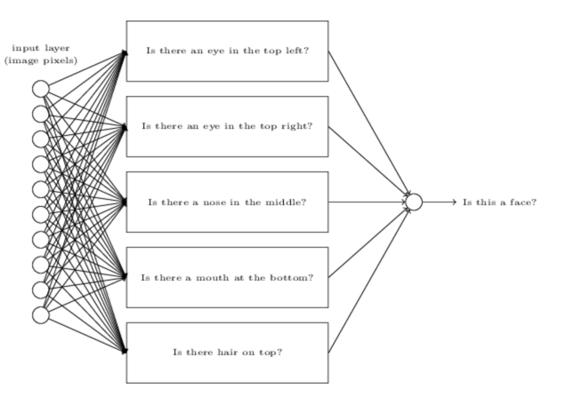

它也可以说明网络是可以分解的。假如我们考虑的问题是左上角是否有一只眼睛，这个问题可以分解为几个子问题：是否有眉毛吗？是否有眼皮，是否有瞳孔？等等。当然，也需要包含对应的位置相关的信息：眉毛是不是在图片的左上部，并且在瞳孔的上方，诸如此类。我们先简化一下，网络是为了回答图片左上方是否有个眼睛这个问题，这样网络可以被分解为下图：

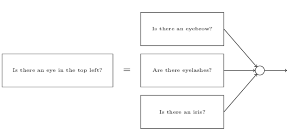

这些问题可以被一层一层分解下去。最终，我们只需要设计能够回答简单问题的子网络，这些问题可以在单个像素层级得到答案。例如，这些问题可能是判断在图片中某一些点是否出现了某些简单的形状。这些问题可以由连接图片原始像素的神经元组来回答。
  最终的结果是，网络从回答一个复杂的问题(图片是否包含一张面孔)分解为几个可以在像素组级别回答的简单问题。由一系列数量众多的层级合力完成。最开始几个层级回答关于输入图片的简单和具体的问题，后面的层级通过层级结构来解决更复杂和抽象的问题。拥有这类多层级结构(包含两个甚至更多个隐藏层)的网络，称之为深度学习网络。
  当然，我还未解释如何迭代分解为子层级。不过通过手动设计权重和偏移量的方式确定是不太可行的。我们还是习惯于运用学习算法，这样网络可以从训练数据中自动学习权重和偏移量(以及概念层级)。 1980和1990年代的研究者们试图使用随机梯度下降和反向传播算法训练深度网络。不巧的是，除了少数特殊的结构，他们并不走运。神经网络确实会自动学习，不过非常缓慢，慢到无法在现实项目中使用。
 2006年后，人们开发了一系列的技术，深度神经网络中学习才成为可能。这些深度学习技术基于随机梯度下降算法和反向传播算法，并加入了一些新的技术。这样训练更深更大的神经网络才变得可行。人们现在通常使用5到10个隐藏层。事实证明，在结果许多问题的时候，这么做要远比浅层级神经网络(例如只有一级隐藏网络的神经网络)表现得优秀。原因当然是，深度网络能够建立一个复杂的概念层级。这有些像传统编程语言中，使用模块化设计以及抽象化概念来构建复杂的计算机程序。把深度网络和浅层级网络对比，就像用支持函数及调用的编程语言与去除了调用功能的简单语言作对比。与传统编程语言相比，抽象化在神经网络中形式有些不同，不过同样他们重要。


